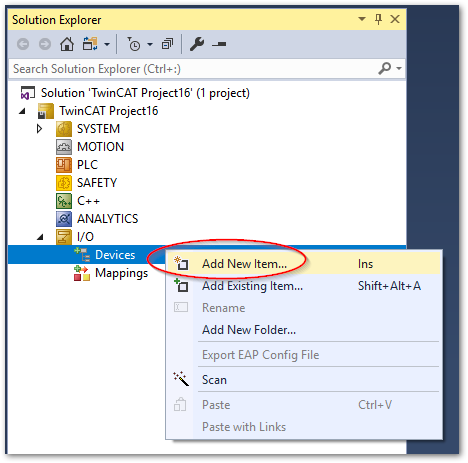
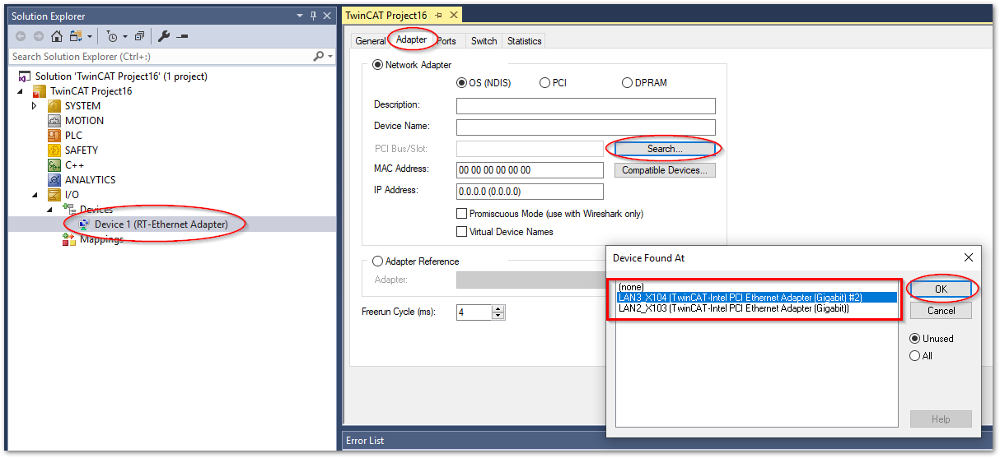

# TwinCATのドライバセットアップ

TwinCAT側がUDPのクライアントソフトとなり、外部のホストにて、UDPのサーバソフトウェアに対する送受信を実現する例について実装方法を説明します。


### Ethernetドライバの作成

1. TwinCATプロジェクト以下の `I/O` > `Devices` を右クリックし、`Add New Item...`を選択します。

   {width=300px align=center}

2. `Ethernet` > `RealTime Ethernet Adapter` を選択してOKボタンを押す

   {width=400px align=center}

3. 作成されたDeviceをダブルクリックして現われたウィンドウから`Adapter`タブを選択し、`Search`ボタンにより、UDPサーバと接続しているネットワークポートを選択します。

   {width=800px align=center}

   ```{note}
   この操作により選択可能なネットワークポートは、[TwinCATリアルタイムネットワークドライバをインストール](https://infosys.beckhoff.com/content/1033/ethercatsystem/1036996875.html?id=3982258869482331233)したポートのみとなります。
   ```

4. Device1が出来上がっているので、これを右クリックし現われたメニューから`Add Object(s)...` を選びます。

   {width=500px align=center}

5. `TcIoEth Modules` > `TCP/UDP RT [Module]` を選択してOKボタンを押します。

   {width=400px align=center}

6. 生成されたオブジェクトをダブルクリックし、現われたウィンドウから`Interface Pointer` タブを開きます。`OTCID` 欄の選択ボタンを押し、追加したデバイスを選択します。

   {width=700px align=center}

   {width=700px align=center}

