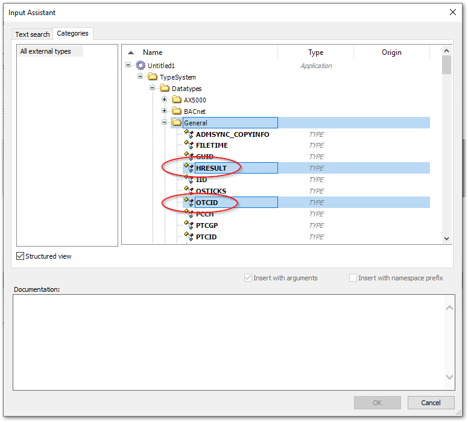
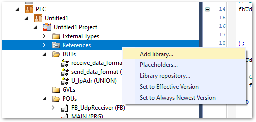
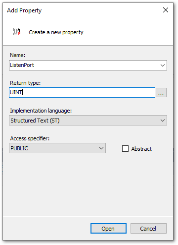

# UDPクライアントの実装

この節ではTwinCAT側がUDPのクライアントソフト実装方法について説明します。下記のサイトで紹介されているサンプルコードをベースとしています。"Downloading the sample." からダウンロードしてください。

[https://infosys.beckhoff.com/content/1033/tf6311_tc3_tcpudp/1077365387.html?id=5050344951114154524](https://infosys.beckhoff.com/content/1033/tf6311_tc3_tcpudp/1077365387.html?id=5050344951114154524)


ただ、本節の説明では、このサンプルからではなく、空のPLCプロジェクトから実装する方法について説明しています。ただし、上記オリジナルサンプルコード中の `FB_UdpReceiver` ファンクションブロックについては以下の変更点のみを掲載しており、全てのコードは掲載していません。

* ReceiveDataメソッドの変更

   サンプルコードはEchoサーバとしての機能実装のため、受信データハンドラであるこのReceiveDataメソッドが実行されますと、受信データをオウム返しで同じデータを送信元に返すプログラムとなっています。これを、プロパティで与えた構造体 `receive_data_format` の変数に対して書き込むだけのメソッドと、受信イベント `receive_complete` を上げる処理を行うように改造します。

* SendDataメソッドの追加

   サンプルコードは、Echoサーバのため、外部から任意のデータを送信するメソッドが提供されていません。このため、送信先のIPアドレス、ポート、および、送信データの構造体変数へのポインタをセットすることで、任意の宛先に任意のデータを送ることができるメソッドを追加します。

上記を踏まえ、順に実装方法を説明します。

## External Typesの追加

1. `External Types` メニューを右クリックし、 `Pin Global Data Type` を選択して現われたInput Assistantウィンドウから次の

   * `Interfaces` > `General` 以下にある次の3つのインターフェースをインストール

      * ITcIoUdpProtocol
      * ITcIoUdpProtocolRecv
      * ITComObjectServer

      {width=700px align=center}


2. `Datatypes` > `General` 以下にある次の2つの型をインストール

   * HRESULT
   * OTCID

   {width=500px align=center}


## Tc2_Utilities ライブラリの追加

T_Arg型を使うためにこのライブラリをインストールする必要があります。

{width=400px align=center}

{width=500px align=center}


## 構造体の登録

DUTs以下に次の構造体を定義します。

1. 送受信データ構造体

   送信データを格納するための構造体と、デモサーバからの応答データを格納する構造体をそれぞれ定義します。いずれも pack_modeを0に設定し、メモリ上の配置をバイト単位に切り詰めた（バイトストリームデータのまま）データ形式として定義します。

   ```{code-block} pascal
   :caption: 送信データフォーマット用構造体
   {attribute 'pack_mode' := '0'}
   TYPE send_data_format :
   STRUCT
      command		: STRING(4);
      seq_number	: UINT;
      value		: ULINT;
   END_STRUCT
   END_TYPE
   ```

   ```{code-block} pascal
   :caption: 受信データフォーマット用構造体
   {attribute 'pack_mode' := '0'}
   TYPE receive_data_format :
   STRUCT
      command		: STRING(4);
      seq_number	: UINT;
      value		: REAL;
   END_STRUCT
   END_TYPE
   ```

   ```{admonition} STRING型について
   :class: note

   STRING型で任意のサイズを指定する場合、実際メモリ上に確保されるサイズは、1Byte多いものとなり、末尾には自動的にNULL文字が付加されます。この例では、4ByteのサイズのSTRING型の変数が定義されておりますが、実際は5Byteのエリアが確保されます。

   ```

   ```{admonition} pack modeについて 
   :class: note

   TwinCAT上では、構造体データをメモリ上に配置するとき、CPU演算におけるメモリアクセス効率を優先する方法と、メモリサイズの効率を優先方法のいずれかを選ぶ事ができます。このパターンはpack_modeと呼ばれるattributeで指定できます。詳しくは下記をご覧ください。
   [https://infosys.beckhoff.com/content/1033/tc3_plc_intro/2529746059.html?id=3686945105176987925](https://infosys.beckhoff.com/content/1033/tc3_plc_intro/2529746059.html?id=3686945105176987925)
   ```

2. IPアドレス設定用共用体を登録

   IPアドレスをバイト型の整数の配列で指定するとDUINTでアクセスできるように、次の通り共用体を定義します。

   ```{code-block} pascal
   :caption: IPアドレス定義共用体定義
   TYPE U_IpAdr :
   UNION
      ipAdrInternal : UDINT;
      ipAdr : ARRAY[0..3] OF BYTE;
   END_UNION
   END_TYPE
   ```

## プログラム実装

### `FB_UdpReceiver` ファンクションブロックの改造

[InfoSysサイトのオリジナルサンプルコード](https://infosys.beckhoff.com/content/1033/tf6311_tc3_tcpudp/1077365387.html?id=5050344951114154524)からダウンロードしたTwinCATプロジェクトを開いて、`FB_UdpReceiver` 全体を編集中のPLCプロジェクトのPOUsへコピーします。この上で以下の変更を行ってください。

* 出力変数の追加

   受信イベント、および、受信データのジェネリクス型変数を出力変数として登録します。

   ```{code-block} pascal
   :caption: FB_UdpReceiver ファンクションブロック変数宣言部
   VAR_OUTPUT
      receive_complete	:BOOL;
      receive_data 		:T_Arg;
   END_VAR
   ```

* FB_UdpReceiverのプログラム部の変更

   下記の一行を追加します。
   
   ```{code-block} pascal
   IF ipUdp <> 0 THEN
      receive_complete := FALSE;   // 追加
      ipUdp.CheckReceived();
   END_IF
   ```

* ReceiveDataメソッドの変更

   変数宣言部は変更無しで、プログラム部を以下のとおり変更する。

   ```{code-block} pascal
   :caption: ReceiveDataメソッド変更前
   nReceivedPakets := nReceivedPakets+1;
   uLastReceivedIP.ipAdrInternal := ipAddr;

   IF ipUdp <> 0 THEN
      hrSend := ipUdp.SendData(ipAddr, udpSrcPort, udpDestPort, nData, pData, TRUE, 0); // send data back
   END_IF
   ```

   ```{code-block} pascal
   :caption: ReceiveDataメソッド変更後
   nReceivedPakets := nReceivedPakets+1;
   uLastReceivedIP.ipAdrInternal := ipAddr;

   IF ipUdp <> 0 THEN
      receive_data.cbLen := nData;
      receive_data.pData := pData;
      receive_complete := TRUE;
   END_IF
   ```

* SendDataメソッドの追加

   以下のメソッドを追加します。

   ```{code-block} pascal
   :caption: SendDataメソッド宣言部
   METHOD PUBLIC SendData : HRESULT
   VAR_INPUT
      dest			: ARRAY [0..3] OF BYTE;
      nTargetPort		: UINT;
      data			: T_ARG;
   END_VAR

   VAR
      uTargetHostIP	: U_IpAdr;
   END_VAR
   ```

   ```{code-block} pascal
   :caption: SendDataメソッドプログラム部
   uTargetHostIP.ipAdr := dest;
   hrSend := ipUdp.SendData(uTargetHostIP.ipAdrInternal, nTargetPort, nUdpPort, data.cbLen, data.pData, TRUE, 0); // send data back
   ```

* ListenPort プロパティの追加

   待ち受けポートを設定する `ListenPort` プロパティを追加します。POUsの下の `FB_UdpReceiver` 右クリックして現われたメニューから、 `Add` > `Property...` を選択し、次図のとおり設定します。

   {width=250px align=center}

   作成された `ListenPort` の`Set`のプログラム部に以下のとおり記述します。

   ```{code-block} pascal
   :caption: ListenPort プロパティ
   // Close default port and open renew port.
   IF SUCCEEDED(ipUdp.UnregisterReceiver(nUdpPort)) THEN
      nUdpPort := ListenPort;
      FB_reinit();
   END_IF
   ```

### MAINプログラムの実装

Pythonで実装したサーバが稼動するホストアドレスは、192.168.2.2 として掲載しています。

```{code-block} pascal
:caption: MAINプログラム宣言部
PROGRAM MAIN

VAR
   fbUdp1 : FB_UdpReceiver;
   send_data		: send_data_format;							// Send message variables
   receive_data 	: receive_data_format;						// Receive message variables
   target_host		: ARRAY [0..3] OF BYTE := [2, 2, 168, 192]; // IP Address of server
   target_port		: UINT := 9998;								// Port number of server listening
   cycle_count		: UINT;
   initialize     : BOOL;
END_VAR
```

```{code-block} pascal
:caption: MAINプログラム部
// Set listen port
IF NOT initialize THEN
	fbUdp1.ListenPort := 9999;
	initialize := TRUE;
END_IF


// Prepare send data
send_data.command := 'SCOM';
send_data.seq_number := cycle_count;
send_data.value := 16#FFFFFFFFFFFFFFFF;

IF cycle_count > 65535 THEN
   cycle_count := 0;
ELSE
   cycle_count := cycle_count + 1;
END_IF

// Send request command
fbUdp1.SendData(
   dest := target_host,
   nTargetPort := target_port,
   data := F_BIGTYPE(pData := ADR(send_data), cbLen := SIZEOF(send_data))
);

fbUdp1(); 

// Get received data to "receive_data" when data received.
IF fbUdp1.receive_complete THEN
   Tc2_System.MEMCPY(ADR(receive_data), fbUdp1.receive_data.pData, fbUdp1.receive_data.cbLen);
END_IF
```


### ビルドとPLCインスタンス設定

PLCプロジェクトのビルドを行うと、PLCのインスタンスに `Symbol Initialization` タブが出現します。次図のとおりPLCの通信インターフェースをUDPリアルタイムアダプタオブジェクトに紐づけてください。

