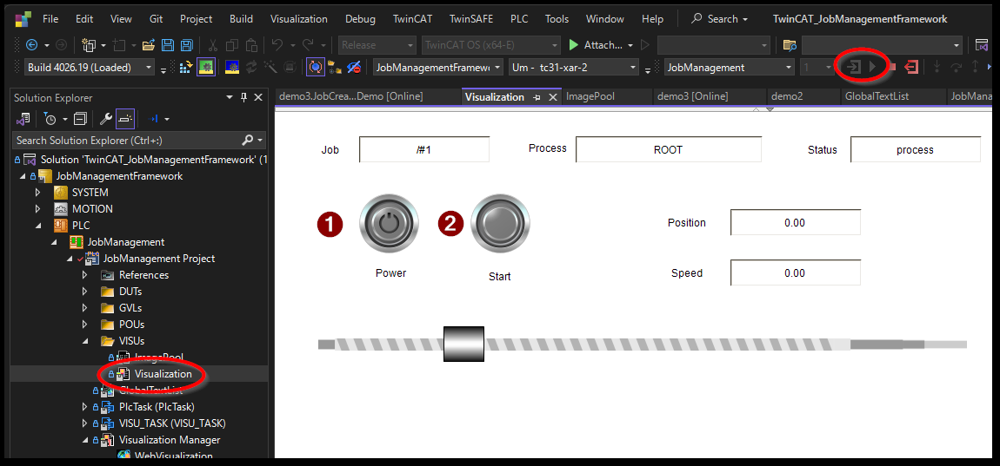

(section_docker_compose_twincat)=
# Docker compose による TwinCAT のデプロイ

`/opt/stacs/TC_XAR_Container_Sample/` 以下にある `docker-compose.yaml` ファイルを編集します。

これをベースに次の修正を行います。

## docker-compose.yaml の編集

### TwinCATインスタンスを2つ定義する

2つのインスタンスを作成するため、`SERVICES` セクション以下の `tc31-xar-base` を、 `tc31-xar-1` とし、 複製して`tc31-xar-2` を作成します。

container_name, hostnameを差別化し、ネットワークのIPアドレスとAMSNetIDをそれぞれ個別の値を割り当てます。

```{code-block} yaml
:caption: 2つのTwinCATコンテナインスタンスを定義する
:name: docker-compose_double_twincat

services:
mosquitto:
    image: eclipse-mosquitto:latest
    :

tc31-xar-1:                         # baseから1への名称変更
    image: tc31-xar-base:latest
    container_name: tc31-xar-1　　　　 # 名称変更
    hostname: tc31-xar-1　　　　　　　  # 名称変更
    :
    networks:
    container-network:
        ipv4_address: 192.168.20.3
    :
    environment:
    #- PCI_DEVICES=NONE
    - AMS_NETID=15.15.15.15.1.1 
    :
tc31-xar-2:
    image: tc31-xar-base:latest
    container_name: tc31-xar-2
    hostname: tc31-xar-2
    :
    networks:
    container-network:
        ipv4_address: 192.168.20.4
    :
    environment:
    #- PCI_DEVICES=NONE
    - AMS_NETID=15.15.15.16.1.1 
```


### 永続化ボリューム設定

TwinCATにてActive Configurationを行うと、ランタイムイメージが `/etc/TwinCAT/3.1` 上に作成されます。この場所をホストOS上のストレージに展開するため、それぞれのコンテナ用に `xar1data`, `xar2data` という名前のボリュームを作成します。（{numref}`docker-compose_volumes`）

これを行わないとメモリ上にデータが作成されますので、再起動するとランタイムイメージは消滅してしまいます。

```{code-block} yaml
:caption: コンテナ内のTwinCATのデータ永続化を行うための設定
:name: docker-compose_volumes

services:
    :
tc31-xar-1:
    :
    volumes:
    - xar1data:/etc/TwinCAT/3.1

tc31-xar-2:
    :
    volumes:
    - xar2data:/etc/TwinCAT/3.1

volumes:
   xar1data:
   xar2data:
```

以上の変更を加えた全体のdocker-compose.yamlを{numref}`whole_docker_compose_yaml`に掲載します。

```{code-block} yaml
:caption: docker-compose.yaml 全体
:name: whole_docker_compose_yaml

networks:
  container-network:
    name: container-network
    ipam:
      driver: default
      config:
        - subnet: 192.168.20.0/24
          gateway: 192.168.20.1

services:
  mosquitto:
    image: eclipse-mosquitto:latest
    container_name: mosquitto
    hostname: mosquitto
    ports:
      - "1883:1883"
    restart: unless-stopped
    volumes:
      - ./simple-mosquitto.conf:/mosquitto/config/mosquitto.conf:ro
    networks:
      container-network:
        ipv4_address: 192.168.20.2

  tc31-xar-1:
    image: tc31-xar-base:latest
    container_name: tc31-xar-1　　　　　　　　  # 名称変更
    hostname: tc31-xar-1　　　　　　　　　　　　 # 名称変更
    restart: unless-stopped
    depends_on:
      - mosquitto
    privileged: true
    volumes:
      - /dev/hugepages:/dev/hugepages:rw
      - xar1data:/etc/TwinCAT/3.1               # 追加
    networks:
      container-network:
        ipv4_address: 192.168.20.3
    # Use PCI_DEVICES as environment variables to specify the Ethernet
    # controllers which can be used by the TwinCAT runtime for real-time
    # ethernet communication.
    # If PCI_DEVICES is not provided at all, TwinCAT will probe all
    # available Ethernet controllers of the host for real-time ethernet communication.
    # If PCI_DEVICES is set to NONE, the TwinCAT runtime won't use probe
    # any PCI Ethernet controller for real-time ethernet communicaion.
    # Set PCI_DEVICES to a space seperated list of PCI slot address
    # to explicitly set Ethernet controllers for real-time ethernet communication.
    # Run `sudo TcRteInstall -l` on the host to get a list of available
    # Ethernet controllers and their PCI slot address
    # Examples:
    #  #- PCI_DEVICES=NONE
    #  - PCI_DEVICES=NONE
    #  - PCI_DEVICES=0000:02:00.0
    #  - PCI_DEVICES=0000:04:00.0 0000:03:00.0
    environment:
      #- PCI_DEVICES=NONE
      - AMS_NETID=15.15.15.15.1.1 

  tc31-xar-2:
    image: tc31-xar-base:latest
    container_name: tc31-xar-2　　　　　　　　  # 名称変更
    hostname: tc31-xar-2　　　　　　　　　　　　 # 名称変更
    restart: unless-stopped
    depends_on:
      - mosquitto
    privileged: true
    volumes:
      - /dev/hugepages:/dev/hugepages:rw
      - xar2data:/etc/TwinCAT/3.1               # 追加
    networks:
      container-network:
        ipv4_address: 192.168.20.4
    # Use PCI_DEVICES as environment variables to specify the Ethernet
    # controllers which can be used by the TwinCAT runtime for real-time
    # ethernet communication.
    # If PCI_DEVICES is not provided at all, TwinCAT will probe all
    # available Ethernet controllers of the host for real-time ethernet communication.
    # If PCI_DEVICES is set to NONE, the TwinCAT runtime won't use probe
    # any PCI Ethernet controller for real-time ethernet communicaion.
    # Set PCI_DEVICES to a space seperated list of PCI slot address
    # to explicitly set Ethernet controllers for real-time ethernet communication.
    # Run `sudo TcRteInstall -l` on the host to get a list of available
    # Ethernet controllers and their PCI slot address
    # Examples:
    #  #- PCI_DEVICES=NONE
    #  - PCI_DEVICES=NONE
    #  - PCI_DEVICES=0000:02:00.0
    #  - PCI_DEVICES=0000:04:00.0 0000:03:00.0
    environment:
      #- PCI_DEVICES=NONE
      - AMS_NETID=15.15.15.16.1.1 

volumes:         # このブロック追加
   xar1data:
   xar2data:
```

## リアルタイムネットワークドライバのコンテナへの割当

1. ホスト側のTwinCATサービスを停止し、イーサネットカードを開放します。

    ```{code} bash
    $ sudo systemctl disable --now TcSystemServiceUm
    ```
2. リアルタイムイーサネットインターフェースカードへvfio-pciドライバの適用
    リアルタイムイーサネット通信には、PCIベースのネットワークデバイス向けにvfio-pciドライバが必要です。コマンドラインツールTcRteInstallを使用して、IPCのネットワークデバイスにvfio-pciドライバを割り当ててください。

    まず、適用可能なネットワークPCIデバイスを`TcRteInstall -l`コマンドで一覧します。

    ```{code} bash
    $ sudo TcRteInstall -l
    +------+------------+----------------------+----------------+------------+------------+------------------------------------+------------+
    | No   | Name       | MAC                  | Location       | Driver     | Override   | Model                              | Link       |
    +------+------------+----------------------+----------------+------------+------------+------------------------------------+------------+
    | 0    | enp2s0     | 00:01:05:45:43:fb    | 0000:02:00.0   | igb        | [-]        | I210 Gigabit Network Connection    | up         |
    | 1    | enp1s0     | 00:01:05:45:43:fa    | 0000:01:00.0   | igb        | [-]        | I210 Gigabit Network Connection    | up         |
    +------+------------+----------------------+----------------+------------+------------+------------------------------------+------------+
    ```

    このうち、`Location` 列に見られるPCIスロット番号を指定し、次のコマンドを発行してコンテナで使用可能な状態にします。たとえば、`enp2s0`のカードにvfio-pciドライバを適用する場合、Locationには、`0000:02:00.0` とあるため、

    ```{code} bash
    $ sudo TcRteInstall -b 0000:02:00.0
    ```
    
    とします。vfio-pciドライバを適用する場合は `-b` を、解除するには、 `-u` を指定します。再度確認します。

    ```{code} bash
    $ sudo TcRteInstall -l
    +------+------------+----------------------+----------------+------------+------------+------------------------------------+------------+
    | No   | Name       | MAC                  | Location       | Driver     | Override   | Model                              | Link       |
    +------+------------+----------------------+----------------+------------+------------+------------------------------------+------------+
    | 0    | enp2s0     | unknown              | 0000:02:00.0   | vfio-pci   | [*]        | I210 Gigabit Network Connection    | up         |
    | 1    | enp1s0     | 00:01:05:45:43:fa    | 0000:01:00.0   | igb        | [-]        | I210 Gigabit Network Connection    | up         |
    +------+------------+----------------------+----------------+------------+------------+------------------------------------+------------+
    ```

    このように、`enp2s0` が `igb` ではなく、`vfio-pci` に切り替わっていることがわかります。

    ```{danger}
    XAEや通常のEthernetに用いるネットワークカードを指定しないでください。Linux OSのネットワークスタックにおける通信が一切できなくなります。
    ```


## TwinCAT Container の起動とデーモン化

これまでの設定によりTwinCAT Containerは以下のコマンドで始動させることができます。

```{code} bash
$ cd /opt/stacs/TC_XAR_Container_Sample
$ sudo docker compose up -d
[+] Running 4/4
 ✔ Network container-network  Created                                0.2s
 ✔ Container mosquitto        Started                                1.4s
 ✔ Container tc31-xar-1       Started                                2.0s
 ✔ Container tc31-xar-2       Started                                2.1s
$
```

また、終了するときは次のコマンドを発行します。

```{code} bash
$ sudo docker compose down
[+] Running 4/4
 ✔ Container tc31-xar-1       Removed                                1.6s
 ✔ Container tc31-xar-2       Removed                                1.4s
 ✔ Container mosquitto        Removed                                0.7s
 ✔ Network container-network  Removed                                0.4s
$
```
````{admonition} ボリュームも含めた完全消去
:class: attention

以下のコマンドを発行すると、Docker compose以下の全てのコンテナは即座に停止し、コンテナイメージおよび、TwinCATの永続化データなどのボリュームも含めて全てが削除できます。完全アンインストール時はこのコマンドを実行してください。くれぐれも取扱いにご注意ください。

```{code} bash
$ sudo docker compose down --rmi all --volumes --remove-orphans
```
````

コンピュータ起動時毎回この操作を行わなければコンテナ起動しません。このため、Linuxのサービス管理機構であるsystemdを用いてサービス化を行います。

まず `/etc/systemd/system/` 以下に `twincat_compose.service` ファイルを新規作成します。（{numref}`code_twincat_container_systemd`）

```{code-block} toml
:caption: /etc/systemd/system/twincat_compose.service
:name: code_twincat_container_systemd

[Unit]
Description=TwinCAT docker-compose service
After=docker.service

[Service]
Type=oneshot
RemainAfterExit=yes
WorkingDirectory=/opt/stacks/TC_XAR_Container_Sample
ExecStart=/usr/bin/docker compose up -d
ExecStop=/usr/bin/docker compose down
TimeoutStartSec=0

[Install]
WantedBy=multi-user.target
```

その後、次のコマンドで設定を反映します。

```{code} bash
$ sudo systemctl daemon-reload 
```

その後、次のコマンドでサービスを起動します。また、enableコマンドを発行しているため、次回再起動時も自動的にTwinCATコンテナが自動的に起動します。

```{code} bash
$ sudo systemctl enable --now twincat_compose
```

TwinCATコンテナを無効化したい場合は、

```{code} bash
$ sudo systemctl disable --now twincat_compose
```

とします。同時に、ホスト側のTwinCATを有効にする場合は、

```{code} bash
$ sudo systemctl enable --now TcSystemServiceUm
```

とします。


## 接続と試運転

1. TwinCAT XAEにてTwinCATプロジェクトを準備します。

    ```{tip}
    以下のプロジェクトは回転軸1軸のシーケンス動作を繰り返すプロジェクトとなっています。お試しください。
    
    [https://github.com/Beckhoff-JP/PLC_JobManagementFramework](https://github.com/Beckhoff-JP/PLC_JobManagementFramework)
    ```

2. {ref}`section_ads_over_mqtt_xae`の節にて、事前にADS-over-MQTTで接続する設定を行っていると思います。設定内容を反映するにはSystemManagerServiceの再起動が必要です。PCの再起動により行ってください。
3. プロジェクトを開き、接続先のタブを確認します。`docker-compose.yaml` で設定した `hostaname:` で定義した名称およびAmsNetIdが一覧されています。接続するターゲットを選び、Active ConfigurationおよびRUNモードへの移行をおこなってください。

    {align=center}

4. RUNモード、および、PLCスタートを行ってください。
5. PLC > JobManagement > JobManagement Project > VISUs > Visualization をダブルクリックしてHMIのシミュレーション画面を表示させます。
6. Powerボタンの続き、Startボタンを押すと、シーケンスが動作します。
    {align=center}