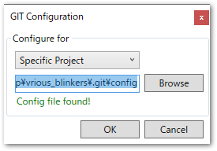

# リポジトリの作成（新規作成）

ここでは、Gitで管理されていないTwinCATプロジェクトを新規にGitリポジトリとして管理するための手順を説明します。

(section_gitignore_for_twincat)=
## TwinCATプロジェクトへの`.gitignore`登録

`.gitignore`とは、そのフォルダ以下にある該当するファイルやディレクトリをバージョン管理対象から無視するための設定です。様々な一時ファイルや、キャッシュなどを除外する設定をあらかじめ行っておき、登録前に

`.gitignore`の置き場所は様々な場所に設置することができますが、この節で設定する対象フォルダは、**TwinCATプロジェクトフォルダ内** です。

```
Solution_Project
│  .gitattributes
│  .gitignore  <------------------- Visual studioが自動的に生成
│  Project1.sln
│
└─TwinCAT_Project
    │  .gitignore  <--------------- ここに置く
    │  TwinCAT Project1.tsproj
```

ソリューションプロジェクトに対しても`.gitignore`を配置しますが、こちらはVisual Studioによって自動的生成されます。

TwinCATプロジェクトフォルダ内に、`.gitignore`という名前のテキストファイルを作成し、テキストエディタにて、以下の内容を書いて保存しておいてください。

```sh
# gitignore template for TwinCAT3
# website: https://www.beckhoff.com/twincat3/
#
# Recommended: VisualStudio.gitignore

# TwinCAT files
*.tpy
*.tclrs
*.compiled-library
*.compileinfo
# Don't include the tmc-file rule if either of the following is true:
#   1. You've got TwinCAT C++ projects, as the information in the TMC-file is created manually for the C++ projects (in that case, only (manually) ignore the tmc-files for the PLC projects)
#   2. You've created a standalone PLC-project and added events to it, as these are stored in the TMC-file.
*.tmc
*.tmcRefac
*.library
*.project.~u
*.tsproj.bak
*.xti.bak
LineIDs.dbg
LineIDs.dbg.bak
_Boot/
_CompileInfo/
_Libraries/
_ModuleInstall/
```

## リポジトリを作成

TwinCATのソリューションを開きます。ソリューションツリーのトップレベルでコンテキストメニューを出し、`Add Solution to Source Control...`を選びます。もし保存していないファイルがあれば保存を求められますので上書き保存を行ってください。

{align=center}

(section_register_compare_viewer)=
## TwinCAT用の差分ビューワの登録

以下の手順で、Gitのリポジトリにおける差分ビューワとして`TcProjectCompare`を登録します。

1. 下図の手順で`TcProjectCompare`を出現し、`Configure User tool...`ボタンを押します。

    ``` TwinCAT > TcProjectCompare ```

    {align=center}

2. `Export Configuration`ボタンを押します。

    {align=center}

3. `Plugin` のセレクトタブから、`Git`を選びます。

    {align=center}

4. `Configure for`において`Spcific Project`を選びます。

    {align=center}

5. フォルダ選択のエクスプローラが現れます。該当するソリューションプロジェクトのフォルダを指定してください。

6. 次図の通り`Config file found!`と表示されれば成功です。

    {align=center}

```{note}
この手順により、ソリューションプロジェクトフォルダの直下にある`.git`フォルダ内の`config`ファイルに、TwinCATの差分エディタに関する設定が出力されます。
```