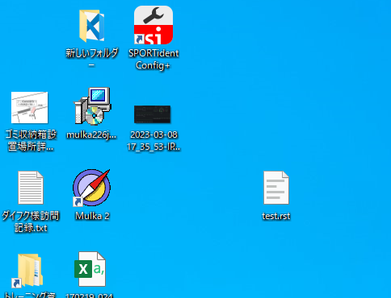

# GitのセットアップとTwinCATの設定

Gitおよび、TortoiseGitのインストールを行います。[GitのWindows向けのインストーラ](https://gitforwindows.org/)が用意されていますが、ここではscoopと呼ばれるWindows向けのパッケージマネージャを用いてインストールします。

scoopパッケージマネージャを使うメリットは、インストール作業がスクリプトで自動化できる点にあります。本HowToサイトの文書ソースはGithubで公開されており、この中に文書作成ビルド環境を構築するPowerShellスクリプトがあります。この中にGitのインストールおよび初期設定を自動化する機能が含まれています。

ここでは、このスクリプトを流用してGitをインストール、設定する手順をご紹介します。

1. 以下のGithubのURLへアクセスし、右上のダウンロードボタンを押して、`setup_environment.ps1` ファイルを保存します。

    [https://github.com/Beckhoff-JP/TwinCATHowTo/blob/1200ad7e38057d5eb2605545fa1b466f51903f0b/setup_environment.ps1](https://github.com/Beckhoff-JP/TwinCATHowTo/blob/1200ad7e38057d5eb2605545fa1b466f51903f0b/setup_environment.ps1)

    {w=30px align=right}

2. ダウンロードした場所でPowerShellターミナルを開き、以下の通りダウンロードしたPowerShellコマンドを実行します。

    ```{code-block} powershell
    PS> PowerShell -ExecutionPolicy RemoteSigned ./setup_environment.ps1 -gitonly -tcconfig
    ```

3. 途中でGitの初期設定のためユーザ名とメールアドレスを聞かれますので、半角英数で入力してください。

    ```{code-block} powershell
    Type user name for git author : Hanako Bekchoff
    Type email address for git author : h.beckhoff@beckhoff.co.jp
    ```

```{admonition} Git用Windows向けクライアントソフト TortoiseGit のご紹介
Gitをインストールしただけですと、原則CUI（コマンドユーザインターフェース）のみの機能が提供されます。Windowsエクスプローラに紐づいてGitの操作を行う便利なヘルパーソフトもありますので、必要に応じて以下のリンクからインストールしてください。
https://tortoisegit.org/
```
