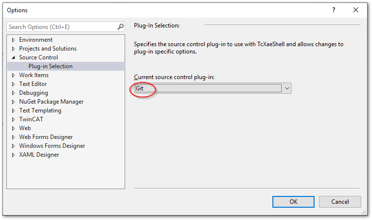

(section_install_git)=
# 導入

[InfoSys サイトリンク](https://infosys.beckhoff.com/content/1033/tc3_sourcecontrol/index.html?id=6468228250695776754)

## Git for windows のインストールと初期設定

Gitおよび、TortoiseGitのインストールを行います。[GitのWindows向けのインストーラ](https://gitforwindows.org/)が用意されていますが、ここではscoopと呼ばれるWindows向けのパッケージマネージャを用いてインストールします。

scoopパッケージマネージャを使うメリットは、インストール作業をスクリプトで自動化できる点にあります。本手順書ではこのスクリプトを実行することで次の項目の実施を自動化します。

* Gitのインストール
* Gitの初期設定（ユーザ名、メールアドレス設定）
* vscodeインストール
* Gitの差分、マージツールをTwinCAT 差分ビューワにセットする
* コミットログエディタをvscodeにする

次の手順にしたがってインストールを行ってください。

```{admonition} 実施するまえに
:class: warning

本手順書は、TwinCAT XAEがインストールされている環境にて行ってください。
```

1. 下記リンクをクリックしてzipファイルをダウンロードする。

    [https://github.com/Beckhoff-JP/TwinCATHowTo/archive/refs/heads/main.zip](https://github.com/Beckhoff-JP/TwinCATHowTo/archive/refs/heads/main.zip)

2. zipファイルを解凍し、TwinCatHowTo-mainフォルダ直下にある`setup_environment.ps1` ファイルを取り出します。

3. エクスプローラで取り出した `setup_environment.ps1` ファイルを選択し、右クリックしてプロパティを選びます。全般タブの、セキュリティ項目を "許可する(K)" にチェックを入れてください。

    {width=300px align=center}

3. `setup_environment.ps1` ファイルを配置した場所でPowerShellターミナルを開き、以下のPowerShellコマンドを実行します。

    ```{code-block} powershell
    PS> PowerShell -ExecutionPolicy RemoteSigned ./setup_environment.ps1 -gitonly -tcconfig
    ```

4. 途中でGitの初期設定のためユーザ名とメールアドレスを聞かれますので、半角英数で入力してください。

    ```{code-block} powershell
    Type user name for git author : Hanako Bekchoff
    Type email address for git author : h.beckhoff@beckhoff.co.jp
    ```

```{admonition} Git用Windows向けクライアントソフト TortoiseGit のご紹介
Gitをインストールしただけですと、原則CUI（コマンドユーザインターフェース）のみの機能が提供されます。Windowsエクスプローラに紐づいてGitの操作を行う便利なヘルパーソフトもありますので、必要に応じて以下のリンクからインストールしてください。

[https://tortoisegit.org/](https://tortoisegit.org/)
```
## TwinCATの設定

1. TwinCAT XAEを立ち上げ、`Tools` > `Options` を開きます。ツリーメニューの、 `TwinCAT` > `XAE Environment` > `File settings` を開き、 `Enable Multiple Project Files` を `True` にします。

    {width=600px align=center}

2. 続いて `Source Control` > `Plug-in Slection` にて、`Current source control plug-in` を、 `Git` に設定します。

    {width=600px align=center}

