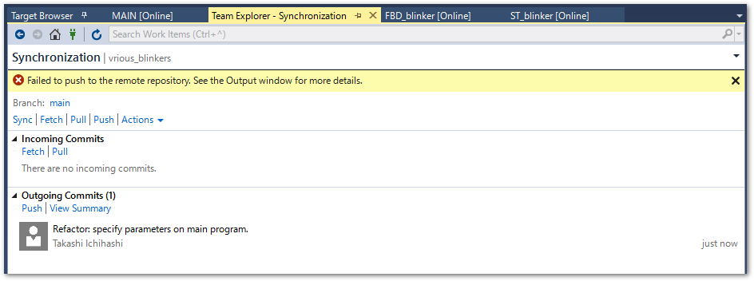
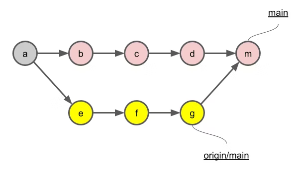
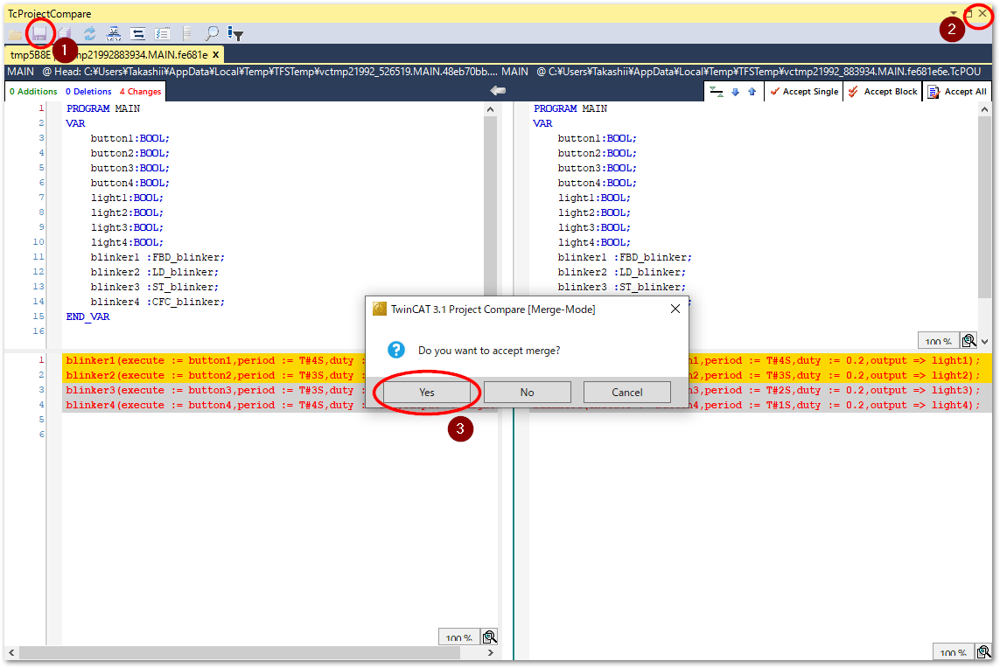
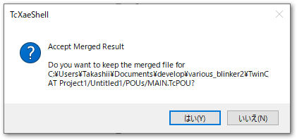
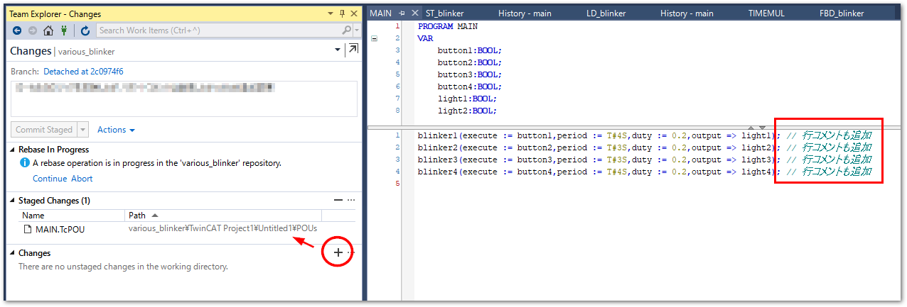

(section_sync_git_remote)=
# 外部リポジトリとの同期

Gitには、外部リポジトリと同期するためのPush/Pullコマンドがあります。この操作方法について説明します。

```{hint}
本節で使用するTwinCAT プロジェクトは、 [Beckhoff-JP/various_blinker](https://github.com/Beckhoff-JP/various_blinker) から取得いただけます。
```

## Githubにリポジトリを作成する

準備として、空のリモートリポジトリを作成します。次図の通りNew repositoryを作成します。オープンソースとして一般公開する場合は`Public`を、限られた組織、個人で使う場合は`Private`を選択します。

この他、`Add a README file`や`Add .gitignore`や`Chooose a license`は全て選択せず、一切のファイルが作成されないようにします。

```{warning}
Github上に何等かのファイルが登録されることで、関連の無いブランチが生成されてしまいます。ここではすでに作成したローカルリポジトリをGithubに反映させますので、Github上にはファイルを作成してはいけません。
```

{align=center}

Create repositoryボタンを押したら新規にリポジトリが生成されます。HTTPSの右端にあるリンクコピーボタンを押して、クリップボードにリモートリポジトリのURLをコピーしてください。

{align=center}

## TwinCAT側の操作

TwinCAT上でリモートリポジトリとの同期を行うには、Team Explorerに移動します。

`Team > Manage Conections...`を選択し、Homeアイコンをクリックします。

{align=center}

次の通り各種Project操作メニューが現れます。

{align=center}

```{csv-table}
:header: アイコン, 説明
:widths: 3,7

Changes, 未コミットの変更を一覧します。
Branches, 他のブランチとマージしたり分岐するための操作が可能です。
Sync, リモートリポジトリ間でブランチを同期します。
Tags, コミットに付与したタグを一覧します。
Setting, リポジトリに対する各種設定を行います。
```

### リモートリポジトリの登録

最初に初期設定として、TwinCAT上のローカルリポジトリのリモートリポジトリとして、Github上のリポジトリに設定します。

Homeのメニューより`Settings`をクリックし、`Repository Settings`へ進みます。`Remotes`項目から`Add`リンクをクリックします。先ほどクリップボードにコピーしたGithubのmainリポジトリのURLを`origin`としてFetch、およびPush先に登録します。

{align=center}

次に、次節のPushの操作を行うことで、Githubにローカルリポジトリの内容が反映されます。

Push後Githubのリポジトリページを見るとリモートリポジトリの内容が反映されていることが分かります。必要に応じて、`Add a README` ボタンを押して、markdown書式によりREADME.mdをルートに作成してください。

{align=center}

### Push：ローカルコミット履歴をリモートリポジトリへ反映する

Homeメニューから`Sync`をクリックします。`Synchronization`の中の、`Push`リンクをクリックすると、ローカルリポジトリの内容がGithubへ送られます。

```{warning}
ただし、前回Pushを行った時点から他の誰かが異なる変更を加えた場合は、Pushに失敗します。Pushを行う前に、次項に示すPullを行ってください。
```

{align=center}

ローカルに行ったコミット履歴は定期的にこの手順でPushを行い、リモートリポジトリに自身が行った変更履歴を反映させます。

### Pull : 他の開発者のコミット履歴を自分のローカルに反映する

リモートリポジトリに他者が行った変更が反映された場合、Pushに失敗し、以下のようなエラーが発生します。

{align=center}

```
Pushing main
Error: failed to push some refs to 'https://github.com/**********/various_blinker.git'
Error: hint: Updates were rejected because the remote contains work that you do
hint: not have locally. This is usually caused by another repository pushing
hint: to the same ref. You may want to first integrate the remote changes
hint: (e.g., 'git pull ...') before pushing again.
hint: See the 'Note about fast-forwards' in 'git push --help' for details.

Error encountered while pushing to the remote repository: rejected Updates were rejected because the remote contains work that you do not have locally. This is usually caused by another repository pushing to the same ref. You may want to first integrate the remote changes before pushing again.

```

この場合、まずリモートリポジトリの変更を自分のリポジトリに取り込む必要があります。この操作をPullといいます。この操作はPushと同様`Sync`メニューから`Synchronization`に進み、`Pull`をクリックして行います。

{align=center}

````{admonition} Pull時のWarningについて 

Pull時のマージ方法が明確でなければ以下のような警告が発生します。

```
Hint: You have divergent branches and need to specify how to reconcile them.
Hint: You can do so by running one of the following commands sometime before
Hint: your next pull:
Hint: 
Hint:   git config pull.rebase false  # merge
Hint:   git config pull.rebase true   # rebase
Hint:   git config pull.ff only       # fast-forward only
Hint: 
Hint: You can replace "git config" with "git config --global" to set a default
Hint: preference for all repositories. You can also pass --rebase, --no-rebase,
Hint: or --ff-only on the command line to override the configured default per
Hint: invocation.
Unable to pull because your local and remote branches changed.
Set your preferred Git behavior for how to reconcile diverged branches in Git settings.
```

リモートリポジトリにより与えられた変更履歴と、自分の行った変更履歴の順番をどのように記録するのかを設定するオプションが3とおり用意されています。警告が現れるのはこの設定が未設定であることを表しています。

pull.rebase false
    : 次図の通りリモートとローカル間での互いの成長を残し、マージコミットを作成します。
      {align=center width=300px}

pull.rebase true
    : 次図の通りリモート側の変更の後にローカルの変更が行われているかのように変更履歴を作成し、コミット記録を作成します。
      {align=center width=300px}

pull.ff only
    : リモート側に他の変更が有れば即座にエラー終了してしまいます。この場合、いったん手動でFetchし、ロカール側でマージまたはリベースした上でPushを行う必要があります。

多くの開発者が共同で開発を行う場合、マージコミットがたくさんある事で分岐が乱立し、非常に履歴が見にくい状態になってしまいます。この理由により`pull.rebase true`を設定していただくことが望ましいでしょう。ただし、どのようなブランチ戦略を取るかは品質管理の点において重要です。上記をよくご理解の上で最適な方法を設定してください。

`pull.rebase true`を設定するには、ターミナルから次のコマンドを発行します。--globalオプションが付いていますので、一度発行すると、開発者のコンピュータ環境においては全てのプロジェクトで有効となります。ご注意ください。

```sh
> git config --global pull.rebase true
```

````

```{warning} 
Pull時に競合が発生すると、自動マージされず、TwinCAT XAE の作業領域の内容は、一旦 **すべてリモートリポジトリの状態** に更新されます。
次項の手順で、競合個所において自分の行った変更をどこまで反映するのか判断し、マージ作業を行ってください。
```

## 競合の解消に向けてのマージ作業

リモートリポジトリに加えられた変更と自分が行った変更個所が、同一のファイルの同一個所である場合、「競合」（コンフリクト）と呼ばれる状態となり、以下のようなログが出力されます。

```
Remote: Total 7 (delta 4), reused 7 (delta 4), pack-reused 0        
Rebase - Applying: perf: change parameters
Warning: Cannot merge binary files: TwinCAT Project1/Untitled1/POUs/MAIN.TcPOU (HEAD vs. perf: change parameters)
Hint: Use 'git am --show-current-patch=diff' to see the failed patch
Error: CONFLICT (content): Merge conflict in TwinCAT Project1/Untitled1/POUs/MAIN.TcPOU
Auto-merging TwinCAT Project1.project.~u
CONFLICT (content): Merge conflict in TwinCAT Project1.project.~u
Patch failed at 0001 perf: change parameters
Resolve all conflicts manually, mark them as resolved with
"git add/rm <conflicted_files>", then run "git rebase --continue".
You can instead skip this commit: run "git rebase --skip".
To abort and get back to the state before "git rebase", run "git rebase --abort".
```

{align=center}

解決するためには、まずRebase in Progressにある、`Conflicts n` のリンクをクリックしてください。

競合しているファイルが一覧されます。

{align=center}

それぞれのファイルをクリックすると、対処方法を操作する枠が出現します。`Compare Files`リンクをクリックすると、差分エディタが表示されます。左側がSource、右側をTargetとして、どちらを採用するかTcProjectCompareで確認の上、編集を行います。

```{figure-md} figure_conficts
{align=center}

競合ファイルの操作パネル
```

```{csv-table}
:header: 番号, 名称, 説明
:widths: 1,1,8

1, Merge, 一旦作業領域はリモートリポジトリの状態に更新されていますので、`TcProjectCompare` ツールにてリモートリポジトリ上の変更と自分の変更の差分を確認しながら自分の設計差分を反映する作業モードに移行します。行単位で自分の変更を反映操作することができます。
2, Take Source, 全ての競合個所について自分の変更を適用します。Diffボタンを押すと、左側に前回Pushした時点の状態、右側に自分のリポジトリで行った変更が差分表示されます。
3, Keep Target, 全ての競合個所についてリモートリポジトリの変更を適用します。Diffボタンを押すと、左側に前回Pushした時点の状態、右側にリモートリポジトリで行われた変更が差分表示されます。
```

```{tip}
* `Compare Files` のリンクは差分表示のみを行います。いったんこちらを確認した上で、マージ作業を行うか、どちらか一方を全面的に採用するか判断する事もできます。
* 左側が自分の変更、右側がリモートリポジトリの状態で表示されます。マージ画面とは逆転していますのでご注意ください。
```

次節から上記の1. Mergeボタンを押して1行ごとに判定しながらマージする方法について説明します。

### 行単位マージツールTcProjectCompareによるマージ

```{admonition} 作業前にご確認ください
* Pullを行った時点でTwinCAT XAEの編集画面は、自分の最終の状態ではなく全てリモートリポジトリの状態に更新されます。
* 以降では `TcProjectCompare` ツールを使って自分の変更との差分を確認しながら、行毎に自分の変更との差分を確認し、反映させる手順を示します。
* マージモード中は、このツールを用いない場合でも編集領域に行った変更が反映されます。本手順の最後に記載されています通り、慎重に差分をチェックした上で `Continue` リンクを押してマージモードを抜けてください。
```
```{admonition} 重要
:class: warning

マージ作業を全て取り消したい場合は、Team ExplorerのSyncメニューの `Rebase In Progress` の欄の `Abort` または、 Resolve Conflicts の `Abort` リンクをクリックしてください。Pull前の状態に戻ります。

{align=center}

{align=center}

```


#### 自分の変更の反映作業

1. {ref}`figure_conficts` 内の、`Merge`ボタンを押すことで、次の通り競合個所の差分が一覧されます。

    {align=center}

    左側がリモートリポジトリの内容、右側が自分のローカルリポジトリに変更を加えた内容となっています。

    例えば、最初の2行は自分のローカルリポジトリのコミットを反映させ、残り2行はリモートリポジトリのままにしておく場合、最初の2行に1行づつカーソルを合わせて都度 `Accept Single` ボタンを押します。

    {align=center}

2. 自分の行った変更が左側に反映されると背景が橙色に変わり、左右が同一の内容になります。

    {align=center}

```{note}
どちらも採用できないような大幅な変更が必要となった場合、`TcProjectCompare` ではプログラム編集はできません。後ほど{ref}`section_free_modifying` の節にて示す手順でプログラム編集する必要があります。この段階で流用したいプログラム内容を記憶させておくため、`TcProjectCompare`上の内容から別のテキストエディタ等へコピーして一時記憶させてください。
```

#### 編集内容の保存

1. フロッピーディスクアイコンを押して反映した内容を保存し、右上のXボタンでウィンドウを閉じようとすると、マージを受け入れるか確認ダイアログが発生しますので、はいを選択します。

    {align=center}

    続いてマージファイルを保存するか確認ダイアログが出現するので、はいをクリックします。

    {align=center}

2. プロジェクトに戻りますので、マージした結果が反映された確認します。

(section_free_modifying)=
### TcProjectCompareで修正できなかった個所の変更と反映

1. `TcProjectCompare` ツールでは加えられなかった修正が必要な場合、この段階でXAE上でプログラム編集を行ってください。

2. 修正した後は、Team ExplorerのChangeメニューに進み、変更を行ったファイルの右側にある `+` アイコンをクリックして、Staged Changesに移動させます。
    {align=center}

```{tip}
* このときコミットコメントを記入する必要はありません。
* Staged Changesに反映されていない変更が残留していると、次手順で示す Synchronization メニューの Rebase In Progressの `Continue` リンクが効かず、マージモードを抜けることができません。
```

### マージモードの終了

1. `TcProjectCompare` によるマージ、および、XAE上での編集が終了しましたら、動作に問題が無いかテストを実施してください。テストに問題が生じた場合はXAE上のプログラムを修正して再度テストを行います。
2. 品質に問題がないことが確認できましたら、最後に、{ref}`section_free_modifying` の手順に従って、テスト時に行われた変更も含めて全てを Staged Change に反映します。
3. Team ExplorerのSyncメニューに進み、次図の通り `Continue` リンクを押します。

    {align=center}

```{tip}
マージ自体を最初からやりなおす場合は、 `Abort` を押します。`Abort`を押すと、Pullを実施する前（自分の変更を行ったローカルリポジトリの最新）の状態に戻ります。
```

これでマージは完了です。続けてPushを行いますと、マージした変更がリモートリポジトリへ反映されます。