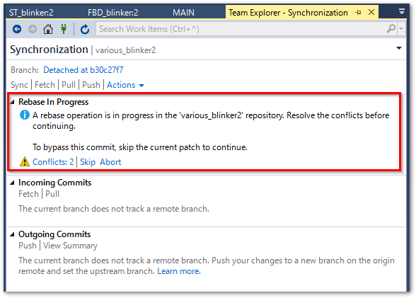
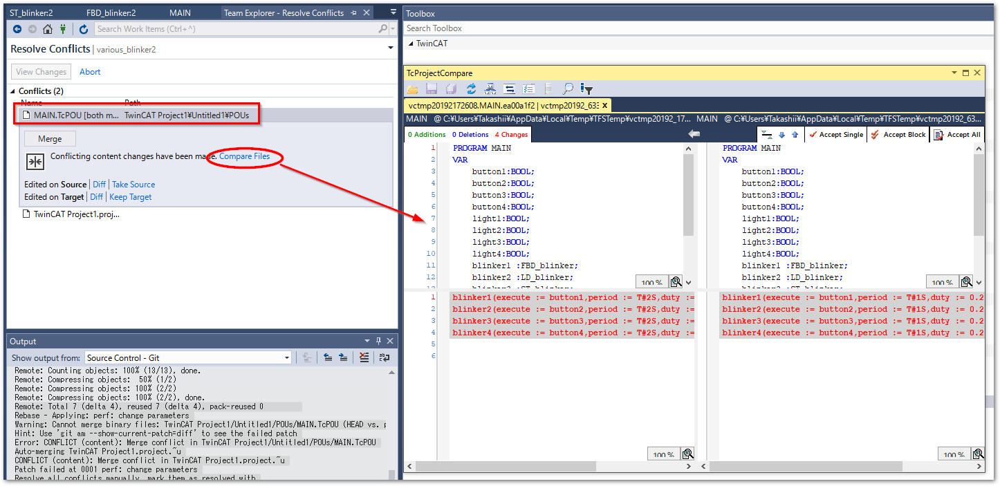

(section_sync_git_remote)=
# 外部リポジトリとの同期

Gitには、外部リポジトリと同期するためのPush/Pullコマンドがあります。この操作方法について説明します。

## Githubにリポジトリを作成する

準備として、空のリモートリポジトリを作成します。次図の通りNew repositoryを作成します。オープンソースとして一般公開する場合は`Public`を、限られた組織、個人で使う場合は`Private`を選択します。

この他、`Add a README file`や`Add .gitignore`や`Chooose a license`は全て選択せず、一切のファイルが作成されないようにします。

```{warning}
Github上に何等かのファイルが登録されることで、関連の無いブランチが生成されてしまいます。ここではすでに作成したローカルリポジトリをGithubに反映させますので、Github上にはファイルを作成してはいけません。
```

{align=center}

Create repositoryボタンを押したら新規にリポジトリが生成されます。HTTPSの右端にあるリンクコピーボタンを押して、クリップボードにリモートリポジトリのURLをコピーしてください。

{align=center}

## TwinCAT側の操作

TwinCAT上でリモートリポジトリとの同期を行うには、Team Explorerに移動します。

`Team > Manage Conections...`を選択し、Homeアイコンをクリックします。

{align=center}

次の通り各種Project操作メニューが現れます。

{align=center}

```{csv-table}
:header: アイコン, 説明
:widths: 3,7

Changes, 未コミットの変更を一覧します。
Branches, 他のブランチとマージしたり分岐するための操作が可能です。
Sync, リモートリポジトリ間でブランチを同期します。
Tags, コミットに付与したタグを一覧します。
Setting, リポジトリに対する各種設定を行います。
```

### リモートリポジトリの登録

最初に初期設定として、TwinCAT上のローカルリポジトリのリモートリポジトリとして、Github上のリポジトリに設定します。

Homeのメニューより`Settings`をクリックし、`Repository Settings`へ進みます。`Remotes`項目から`Add`リンクをクリックします。先ほどクリップボードにコピーしたGithubのmainリポジトリのURLを`origin`としてFetch、およびPush先に登録します。

{align=center}

次に、次節のPushの操作を行うことで、Githubにローカルリポジトリの内容が反映されます。

Push後Githubのリポジトリページを見るとリモートリポジトリの内容が反映されていることが分かります。必要に応じて、`Add a README` ボタンを押して、markdown書式によりREADME.mdをルートに作成してください。

{align=center}

### Push：ローカルコミット履歴をリモートリポジトリへ反映する

Homeメニューから`Sync`をクリックします。`Synchronization`の中の、`Push`リンクをクリックすると、ローカルリポジトリの内容がGithubへ送られます。

```{warning}
ただし、前回Pushを行った時点から他の誰かが異なる変更を加えた場合は、Pushに失敗します。Pushを行う前に、次項に示すPullを行ってください。
```

{align=center}

ローカルに行ったコミット履歴は定期的にこの手順でPushを行い、リモートリポジトリに自身が行った変更履歴を反映させます。

### Pull : 他の開発者のコミット履歴を自分のローカルに反映する

リモートリポジトリに他者が行った変更が反映された場合、Pushに失敗し、以下のようなエラーが発生します。

{align=center}

```
Pushing main
Error: failed to push some refs to 'https://github.com/**********/various_blinker.git'
Error: hint: Updates were rejected because the remote contains work that you do
hint: not have locally. This is usually caused by another repository pushing
hint: to the same ref. You may want to first integrate the remote changes
hint: (e.g., 'git pull ...') before pushing again.
hint: See the 'Note about fast-forwards' in 'git push --help' for details.

Error encountered while pushing to the remote repository: rejected Updates were rejected because the remote contains work that you do not have locally. This is usually caused by another repository pushing to the same ref. You may want to first integrate the remote changes before pushing again.

```

この場合、まずリモートリポジトリの変更を自分のリポジトリに取り込む必要があります。この操作をPullといいます。この操作はPushと同様`Sync`メニューから`Synchronization`に進み、`Pull`をクリックして行います。

{align=center}

````{admonition} Pull時のWarningについて 

Pull時のマージ方法が明確でなければ以下のような警告が発生します。

```
Hint: You have divergent branches and need to specify how to reconcile them.
Hint: You can do so by running one of the following commands sometime before
Hint: your next pull:
Hint: 
Hint:   git config pull.rebase false  # merge
Hint:   git config pull.rebase true   # rebase
Hint:   git config pull.ff only       # fast-forward only
Hint: 
Hint: You can replace "git config" with "git config --global" to set a default
Hint: preference for all repositories. You can also pass --rebase, --no-rebase,
Hint: or --ff-only on the command line to override the configured default per
Hint: invocation.
Unable to pull because your local and remote branches changed.
Set your preferred Git behavior for how to reconcile diverged branches in Git settings.
```

リモートリポジトリにより与えられた変更履歴と、自分の行った変更履歴の順番をどのように記録するのかを設定するオプションが3とおり用意されています。警告が現れるのはこの設定が未設定であることを表しています。

pull.rebase false
    : 次図の通りリモートとローカル間での互いの成長を残し、マージコミットを作成します。
      {align=center}

pull.rebase true
    : 次図の通りリモート側の変更の後にローカルの変更が行われているかのように変更履歴を作成し、コミット記録を作成します。
      {align=center}

pull.ff only
    : リモート側に他の変更が有れば即座にエラー終了してしまいます。この場合、いったん手動でFetchし、ロカール側でマージまたはリベースした上でPushを行う必要があります。

多くの開発者が共同で開発を行う場合、マージコミットがたくさんある事で分岐が乱立し、非常に履歴が見にくい状態になってしまいます。この理由により`pull.rebase true`を設定していただくことが望ましいでしょう。ただし、どのようなブランチ戦略を取るかは品質管理の点において重要です。上記をよくご理解の上で最適な方法を設定してください。

`pull.rebase true`を設定するには、ターミナルから次のコマンドを発行します。--globalオプションが付いていますので、一度発行すると、開発者のコンピュータ環境においては全てのプロジェクトで有効となります。ご注意ください。

```sh
> git config --global pull.rebase true
```

````

次節でその方法について説明します。

## 競合の解消とマージ


通常、他者が行った変更の対象ファイルが被らなかったり、被っても同一ブロックの変更でなければ、自動的に自分のファイルとマージが行われます。しかし、同一のファイルの同一個所を編集した場合、「競合」（コンフリクト）と呼ばれる状態となり、以下のようなログが出力されます。

{align=center}

```
Remote: Total 7 (delta 4), reused 7 (delta 4), pack-reused 0        
Rebase - Applying: perf: change parameters
Warning: Cannot merge binary files: TwinCAT Project1/Untitled1/POUs/MAIN.TcPOU (HEAD vs. perf: change parameters)
Hint: Use 'git am --show-current-patch=diff' to see the failed patch
Error: CONFLICT (content): Merge conflict in TwinCAT Project1/Untitled1/POUs/MAIN.TcPOU
Auto-merging TwinCAT Project1.project.~u
CONFLICT (content): Merge conflict in TwinCAT Project1.project.~u
Patch failed at 0001 perf: change parameters
Resolve all conflicts manually, mark them as resolved with
"git add/rm <conflicted_files>", then run "git rebase --continue".
You can instead skip this commit: run "git rebase --skip".
To abort and get back to the state before "git rebase", run "git rebase --abort".
```

解決するためには、まずRebase in Progressにある、`Conflicts n` のリンクをクリックしてください。

{align=center}

競合しているファイルが一覧されます。

{align=center}

それぞれのファイルをクリックすると、対処方法を操作する枠が出現します。`Compare Files`リンクをクリックすると、差分エディタが表示されます。左側がSource、右側をTargetとして、どちらを採用するかTcProjectCompareで確認の上、編集を行います。

{align=center}