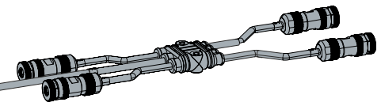
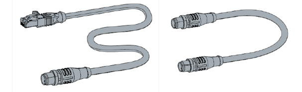

# 概要

XPlanarに関する概要についてご紹介します。事前にお知りいただく事でスムーズな開発が可能となります。詳細は、以下の取り扱い説明書をご覧ください。

取扱説明書
  : [https://download.beckhoff.com/download/document/motion/xplanar_ba_ja.pdf](https://download.beckhoff.com/download/document/motion/xplanar_ba_ja.pdf)

## 仕様

位置決め精度、速度などの諸元は以下の通りです。

```{csv-table}
:header: 項目, 動作範囲, 繰り返し精度, 単位分解能 ,最高速度

{math}`X`, タイル数に依存,  {math}`\pm 10 \mu m`, {math}`\pm 1 \mu m`,{math}`2m/s`
{math}`Y`, タイル数に依存, {math}`\pm 10 \mu m`, {math}`\pm 1 \mu m`, {math}`2m/s`
{math}`Z`, {math}`2 \sim 5 mm`,{math}`\pm 10 \mu m`, {math}`\pm 1 \mu m`
{math}`a (\theta x)`, {math}`\pm` 5{math}`^\circ`,{math}`\pm 0.03 ^\circ`,{math}`\pm 0.01 ^\circ` 
{math}`b (\theta y)`, {math}`\pm` 5{math}`^\circ`,{math}`\pm 0.03 ^\circ`,{math}`\pm 0.01 ^\circ`
{math}`c (\theta z)`, {math}`\pm` 5{math}`^\circ`,{math}`\pm 0.03 ^\circ`,{math}`\pm 0.01 ^\circ`
```

* 最大接続可能タイル数は、EtherCAT G マスタにつき10枚までです。
* 最大実装可能EtherCAT G マスタ数は10個までです。

## 部品構成

### タイル

```{list-table}
:widths: 4,6

  * - 型番
        :  APS4322-0000-0000
      青色
        : M6サイズの６つの取り付け用ホールを使用してタイルとマシンベッドを固定

      赤色
        : ２つの位置決めピンによるタイル配置

      緑色
        : 冷却ファンも取り付け
    - 
  * - コネクタ
        : X100
            : * 駆動用 AC  {math}`100 \sim 230V 16A`
              * 制御用 DC  {math}`24V 0.5A`

          X103
            : 冷却ファン DC {math}`24V`, 外部信号用
          
          X101 / X102
            : EtherCAT G in/out
    - 
```

* TwinCAT 上では Parts と表現される。
* 各 Tile 毎に個別のシリアル番号(BTN)が割り振られています。
  プログラムの設定に使用する。
  装置を組み上げる際には BTN と接続構成を記録しておくことを推奨する。
  プログラムに BTN を使用するため、1 つのプログラムを同じ構成の XPlanar の装置にそのまま適用することはできないので注意する。
* 各 Tile にはファン(冷却装置)を設置する必要がります。
  スターターキットにはファンが設置されていますが、増設や個別で購入した場合はオプションとなっています。これは冷却方式を空冷以外にも対応できるようにするための措置となっています。
* EtherCAT では 4 Tile/Port, EtherCAT G では 10 Tile/Port 接続できる。

### ケーブル類

```{list-table}
:widths: 4,6

  * - 電源分配ケーブル ZC2000-0000-018
        : X100へ接続できるM12コネクタを4つ備えたケーブル
    - 
  * - 電源分配ケーブル ZC2000-0000-017
        : X100へ接続できるM12コネクタを6つ備えたケーブル
    - 
  * - EtherCAT Gケーブル ZK1096-8191-0xxx
        : マスタ - タイル間の接続ケーブル

      EtherCAT Gケーブル ZK1096-8181-0xxx
        : タイル - タイル間の接続ケーブル
    - 
```

### 可動子

```{list-table}
:widths: 4,6

  * - APM4220-0000 可動子
      : * 電子部品等はない
        * 構成部品
            * アルミ製ボディー 
            * 4つの永久磁石
            * プラスティック製バンパー
      : 黄色
          : BTN識別子

        青色
          : M4治具取り付け用ホール　8個
        
        赤色
          : 位置決めピン用ホール　2個
    - 

```

```{warning}
磁性体の吸引磁力は約{math}`400Kg/m^2` です。

* 動作エリア外に可動子を運ぶ際は必ず搬送用トレーに入れてから持ち運びしてください。
* バンパーを取り外してのご使用は絶対に行わないでください。
```

可動子のラインナップは次の通りです。

```{csv-table}
:header: 型番, 可動子サイズ, 積載負荷

APM4220-0000, {math}`113mm \times 113mm \times 12mm`, {math}`0.6Kg`
APM4230-0000, {math}`115mm \times 155mm \times 12mm`, {math}`0.8Kg`
APM4221-0000, {math}`127mm \times 127mm \times 12mm`, {math}`1.0Kg`
APM4330-0001, {math}`155mm \times 155mm \times 12mm`, {math}`1.2Kg`
APM4350-0000, {math}`155mm \times 235mm \times 12mm`, {math}`3.0Kg`
APM4550-0000, {math}`235mm \times 235mm \times 12mm`, {math}`4.5Kg`
```

- 可動子のBTN番号はタイルとは異なり制御プログラム上では個体特定（Identify）の目的には使用しません。制御を有効（Enable）した時点のタイル上に配置された可動子の位置により動的にマッピングされます。またオプションのIDバンパーによりIDに紐づいた個体マッピングされます。
- 大きさの違う 3 種類の Mover があり、異なる種類の Mover を混在できる。
- Mover Width と Mover Height で GAP が設定される。ブラケットや可搬物によって実質の干渉サイズが変わる場合は変更する。
- タイル外には 1mm まで外に出れる。基本的には外に出ないような動作で制御する。
- 特定の地点で制限なしで C 方向に回転できる。回転できる位置はタイルを 4 分割した交点です。
  0°,90°,180°,270° であれば回転した状態で移動可能です。
- Mover が移動する際にまたがる Tile の数が多いほど可搬重量及び回転する力が強い。移動する際にも同様です。

## 制御仕様

### 動作指令方法の種類

次の3つの方式でプログラム上から動作を指示することができます。

MoveToPoint
  : 移動目標座標を直接指定して位置決めする方式です。
    - 事前の準備は不要でプログラムロジックのみ行います。
    - 静的な衝突回避機能があります。動的な衝突回避機能はありません。
    - Trackとの併用はできません。

Track
  : プログラムで平面座標を用いた経路データを登録し、経路に従った動作指令を行います。経路データは目的地まで連続した単一のものではなく、複数の経路をつなぎ合わせた経路計画が可能です。
    - MoveToPoint との併用はできません。
    - 動的な衝突回避機能を使用することができます。
    - 特定のルートを周回させますので、意図しない衝突などが起こりにくいという特徴があります。

ExternalSetPoint
  : Mover の制御軸以外に同期させるための主軸を用意し、主軸に対して動作指令を行います。主軸に対して複数の可動子を従属させ、連動動作させることができます。
    - 衝突回避機能はご利用いただけません。
    - Trackとの併用が可能で、Track 軌道外で動作させることができます。
    - 電子カムを使用することで攪拌のような複雑な動作を実現できます。

### タスクとリソース

可動子制御タスクのCPUリソース割り当てには以下の制約があります。

```{admonition} 可動子制御タスクの制約事項
:class: tip

* 1つの可動子制御タスクで、2つまでの可動子が制御可能です。
* 可動子を制御するCPUコアは、Isolated設定とし、{math}`100\%` TwinCATのタスクに割り当てなければなりません。
* タスクの制御サイクルを{math}`250 \mu s`にしなければなりません。
```

つまり、CPUコアのうち一つにつき制御可能な可動子の2個までとなります。また、このタスクはあくまでも可動子のダイナミクスに関する制御用のタスクであり、別途PLCや仮想軸などのタスクが必要となります。こちらはサイクルタイムやコアに割り当てるリソースの制約はありませんが、タスク周期を遅くしすぎると命令や情報の更新が遅くなるので注意する必要があります。

### モーションTcCOMモジュールについて

XPlanarのコンフィギュレータツールを使うと、次図に示す制御モジュールとタスクが自動的に生成されます。

{align=center}

前述の可動子制御タスクは、次図の緑枠線内に示すもので、TcCOMとして実装されます。またモーション軸制御には、XPlanar MC Project上に実装されます。このMC Project内に、PLCとのリンク用のオブジェクトが生成されます。

Axes
  : 可動子毎の制御オブジェクトです。MC_PlanarMoverをリンクします。

Group
  : Planar Environment
    : 環境設定。 PLCとの間で MC_PlanarEnvironment をリンクします。

  : Planar Group
    : XPlanar のグループ。 MC_PlanarGroup をリンクする。

  : Planar Track
    : 各 Track 毎に必要です。 MC_PlanarTrack をリンクする。

動作指令方法として、単一のMoverのMoveToPoint方式の動作だけであればGroupは使いません。

### XPlanar Utility

TcCOMやタイルEtherCATサブデバイスからSDOデータを通じて抽象度の低いデータアクセスにより機器から直接診断情報などを得るための機能群です。機器そのものの情報ですので、シミュレーション環境ではデータ収集が行えません。

インターフェースを通してI_TcIoXPlanar.TileCoE(Area, Tile).DiagData.情報
Utility で設定した複数のパラメータを変更できる。
Scope 用のデータは通常の方法では取得できないが、Utility を経由すると取得できる。


### 衝突回避機能

衝突回避の距離は Gap と Collision Range で設定します。Gap が優先的に反映されます。Collision Range はデフォルトで自動的に設定されます。ギリギリまで近づける必要が有る場合のみ手動で設定します。

衝突回避の機構には次の2種類があります。

Track 衝突回避
  : - 動作中も相互に衝突を回避することが可能です。
    - 目標位置に到着できない場合、Busy 状態で順番待ちをする。
    - 移動できる状態になり次第、目標位置に向かって移動する。

Group 衝突回避
  : 目標位置までの経路に Group に所属した Mover が存在した際に指令が正常に動作しない形で衝突回避を行います。

## ソフトウェアとライセンス

以下のソフトウェアライセンスとパッケージインストールが必要となります。以下のリンクからソフトウェアをダウンロードいただき、XAE, XARともにインストールを行ってください。

[TF5890 TwinCAT 3 XPlanar](https://www.beckhoff.com/ja-jp/products/automation/twincat/tfxxxx-twincat-3-functions/tf5xxx-motion/tf5890.html)
  : * XPlanar driver
    * XPlanar configurator
    * Tc3 Physics library
    * TF5020 NC PTP Axes Pack unlimited
    * TF5410 Motion Collision Avoidance
    * TF5430 Planar Motion Base
