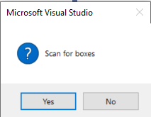
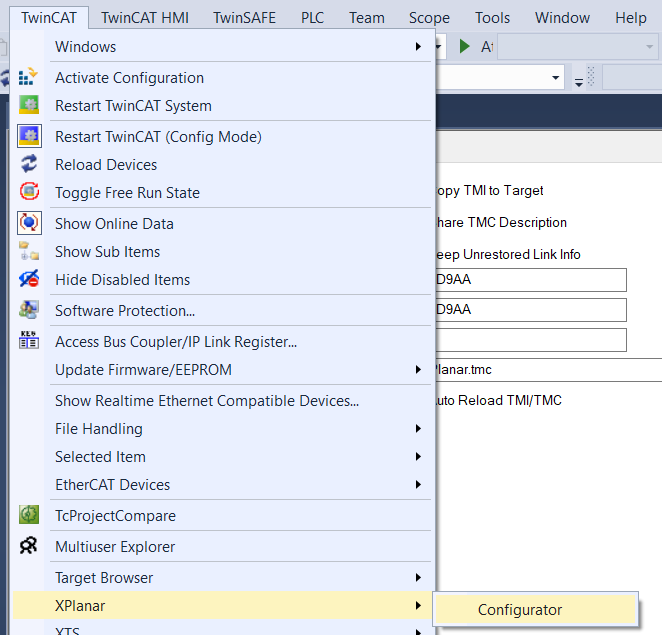
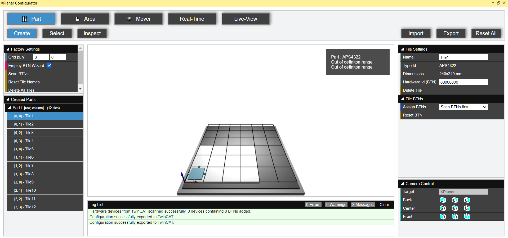
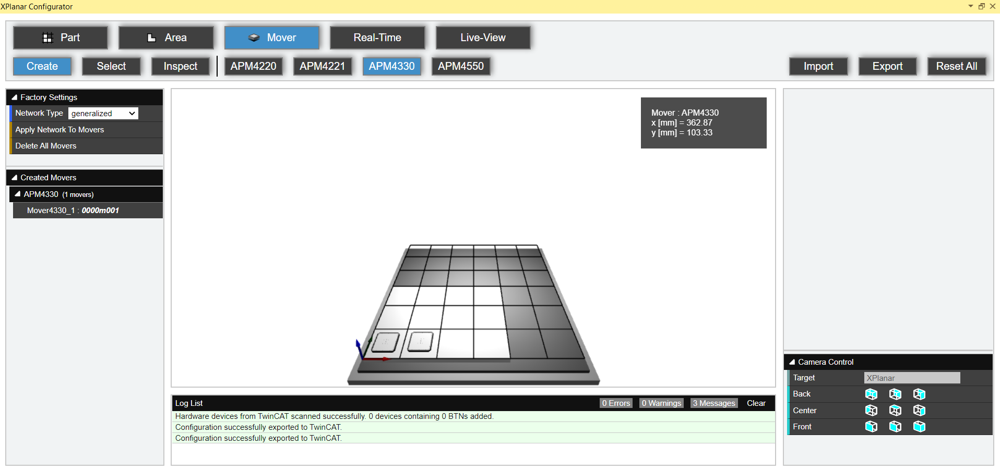
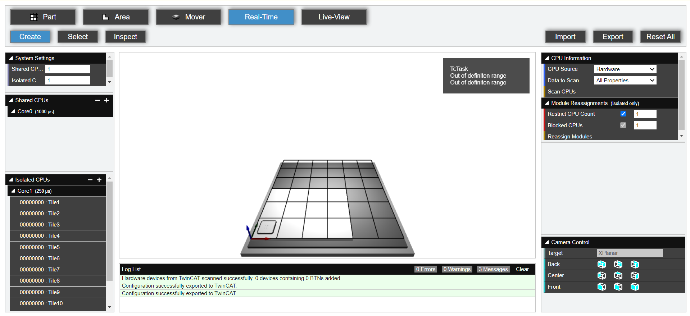
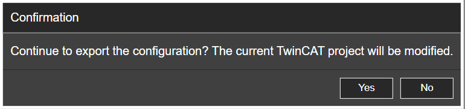
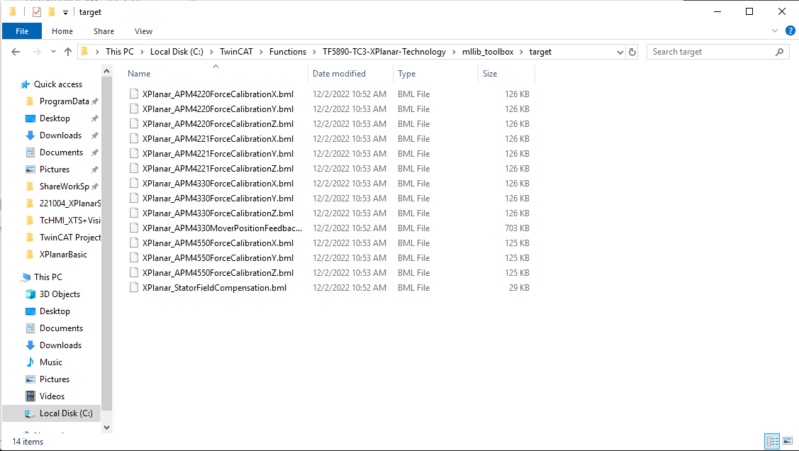
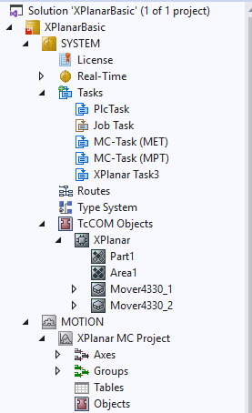

# Configurator 手順


## EtherCAT接続とFreeRunへの移行

```{list-table}
:widths: 1, 30, 60

* - 1
  - I/O > Devices > Scan を選択する。
  - {align=left}

* - 2
  - 注意文が出るので OK を押す。
  - {align=left}

* - 3
  - EtherCAT 接続されたポートを選択(自動)して OK を押す。
  - 

* - 4
  - Scan for boxes のダイアログが出るので、Yes を選択する。
  - 

* - 5
  - 接続されたデバイスが登録されます
  - {height=500px}
```

以上でFreeRun モードでEtherCATサブデバイスが認識されます。

## Configuratorの起動

```{list-table}
:widths: 30, 60

* - TwniCAT > XPlanar > Configurator を選択する。
  - 
```

## Parts 設定

タイル設定を行います。

1.`Parts`ボタンを押し、中央グラフィックのマトリックスから配置しているタイルの形状となるよう、個々のタイルクリックします。クリックした個所は明るい色にハイライトされます。

  {align=center}
  

```{list-table}
:widths: 1, 60, 40

* - 2
  - 画面左上の Factory Settings から ScanBTN を選択する。
    ````{tip}
    FreeRun モードでないと Scan BTNs で Device が見つかりません。
    ````
  - 

* - 3
  - Tile Settings から Assign BTNs で適切な BTN を割り当てる。
  - {width=300px}    
    {width=300px}

* - 4
  - 全て選択すると下記のようになります。
    (BTN はご使用の XPlanar 固有のものになります。)  
  - {width=300px}
```

## Mover 設定

上部のボタンから使用する Mover 種類を選択し、タイル上に使用する個数だけクリックして可動子を配置します。  



## Real-Time 設定

1. `Real Time` ボタンを押す
  

```{list-table}
:widths: 1, 60, 40

* - 2
  - 使用する Core の割り当てを入力する。  
  - {width=300px}

* - 3
  - Reassign Modules を選択する。
    Isolated Core に設定するため`Restrict CPU Count`に 1 を入れます。
  - {width=300px}
* - 4
  - Isolated CPUs の 250 µs のコアに割り当てられているか確認する
  - {width=300px}

```

## 設定データの出力

下記の操作にて次の処理が行われます。処理が完了するまでTwinCATのプロジェクトを閉じない様に注意してください。

* bmlファイルの出力
* TwinCATのモーション軸の生成

次の手順を実行します。
1. 上部メニューから Export を選択する
  

```{list-table}
:widths: 1, 30, 60

* - 2
  - 確認画面で Yes を選択する。
  - 

* - 3
  - Console 画面が表示される。
  - 

* - 4
  - 処理が完了すると、自動的にbmlファイルが生成されたフォルダをエクスプローラで開かれます。
  - 
    ```
    C:\TwinCAT\Functions\TF5890-TC3-XPlanar-Technology\mllib_toolbox\target
    ```

* - 5
  - これらのファイル全てを選択し、ターゲットIPCの以下のフォルダへ配置してください。
  - 
    ```
    C:\TwinCAT\3.1\Target\Config\XPlanar\bml
    ```

* - 6
  - TwinCAT XAE 上のプロジェクトには、SYSTEM, MOTION に自動でオブジェクトが登録されます。
  - 
```