#  チューニング

## Scope viewの準備


Target browser からADS port 350を選択し、Soft Drive - SdScopeVariable に現れる次のの指標を YT Scope 上に記録できるようにします。。

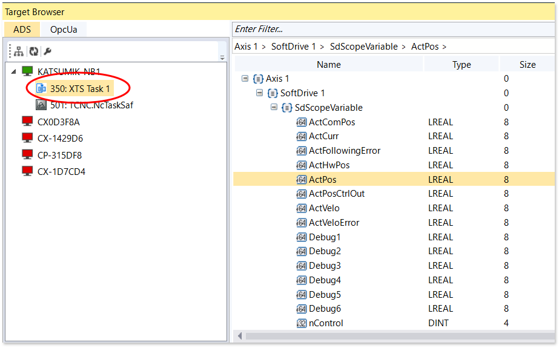{align=center}


Positions
    : * 実位置  ActPos
      * 指令位置　SetPosltp

Velocities
    : * 実速度 ActVelo
      * 指令速度 SetVeloltp

PosError
    : * 位置偏差


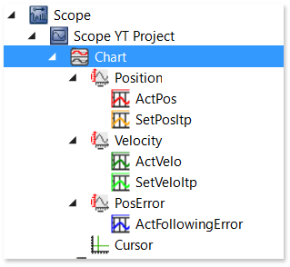{align=center}

## 共振周波数の除去

可動子および冶具を含めた、固有の共振周波数を除去することで、サーボON時や動作時の共振を抑えることができるようになります。XTSでは「Tuning Assist」機能を用いることで、この共振周波数を除去するための最適値を得ることが可能となります。


1. `TcCOM Objects` にて右クリックのコンテキストメニューかｒ `Add New Item...` を選択し、 XtsMoverTuningAssystant モジュールを追加します。
   
    `XTS with NC2` > `Mover Controller` > `XtsMoverTuningAssistant [Module *.*.**.*]`
   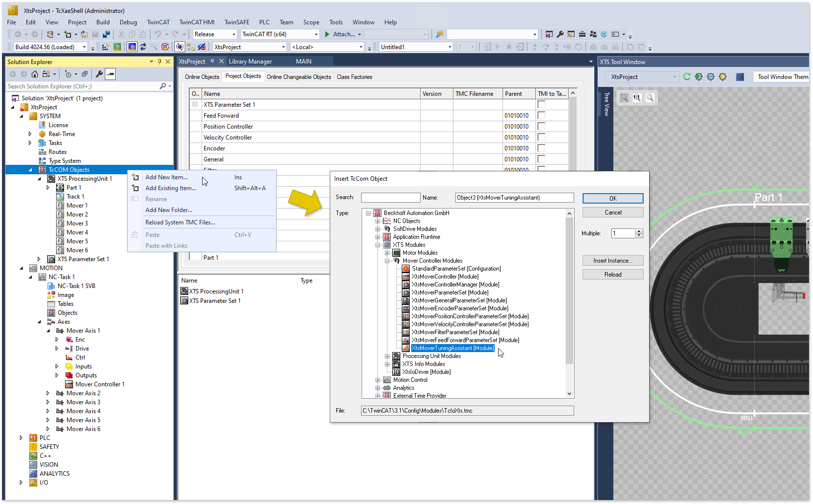{align=center}

2. `XtsMoverTuningAssistant` を作成すると、自動的に `Job Task` タスクが作成されます。オブジェクトとタスクを紐づけます。
   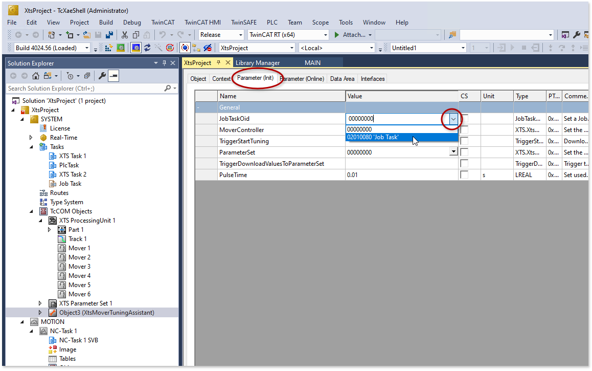{align=center}


4. チューニングアシスト対象のMoverを選択します。
   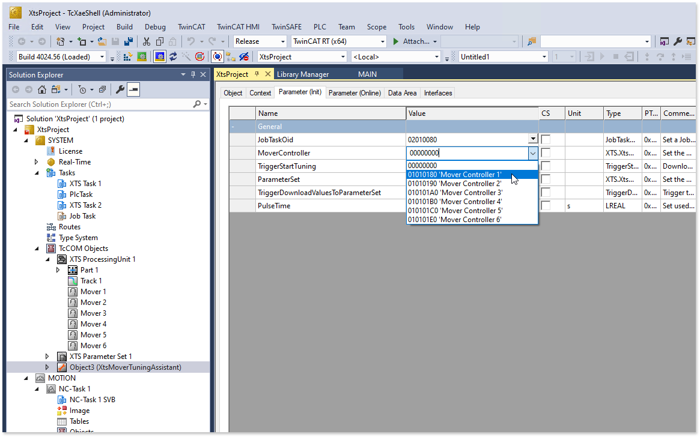{align=center}

5. 仮想軸（Axis）の Parameter タブにある `Monitoring` - `Position Lag Monitoring` をFalseに設定変更します。

    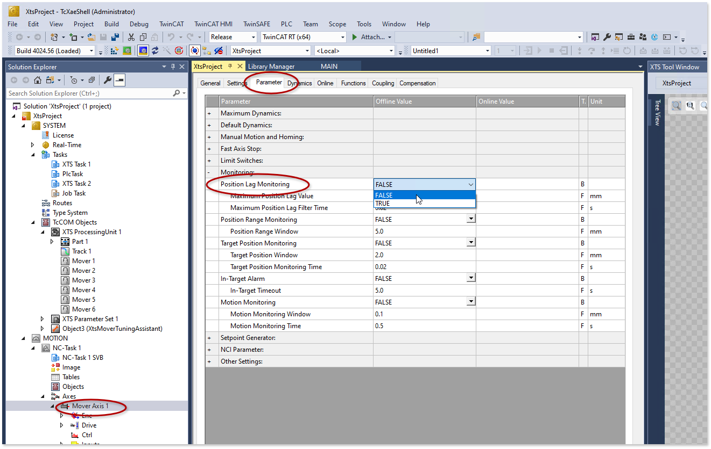{align=center}


6.  Active Configuration を行って下さい。

7. No.1 可動子の検出を行います。
   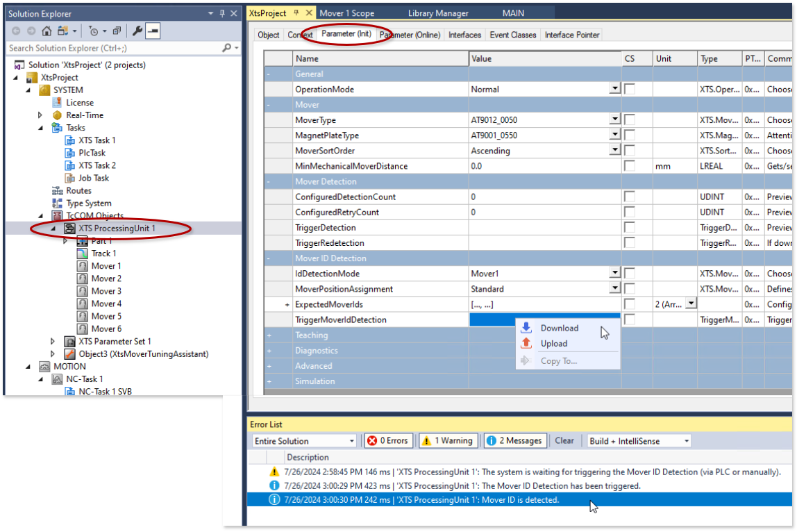{align=center}

8. 該当の可動子のAxisの`Online`タブの`Enabling`からサーボONしてください

9. チューニングをスタートします
   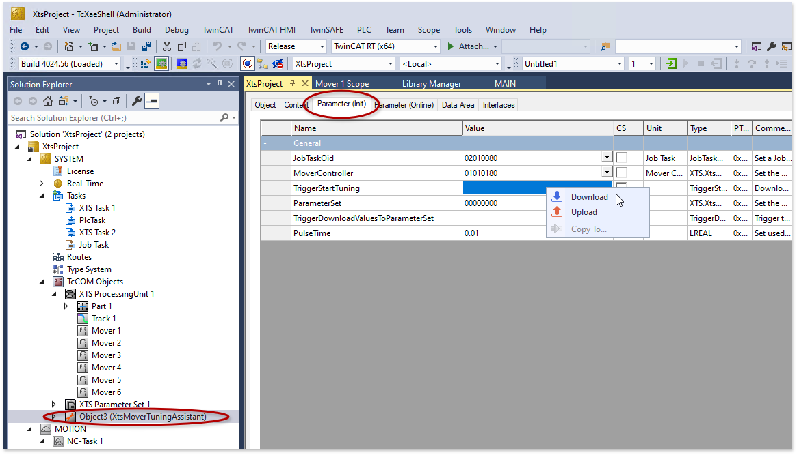{align=center}

   実施結果は、隣のタブ `Parameter(Online)` のInfo欄の `TuningState` に現れます。もし何等かのErrorが発生した場合は、下部のError Listのメッセージを合わせて確認して対処を行ってください。

   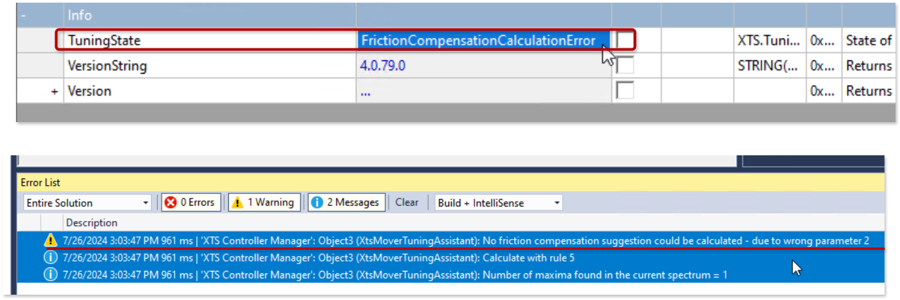{align=center}

10. 保存したい Parameter Set を選択し、Tuning Assistant オブジェクトのオンライン列にパラメータを書き出します
    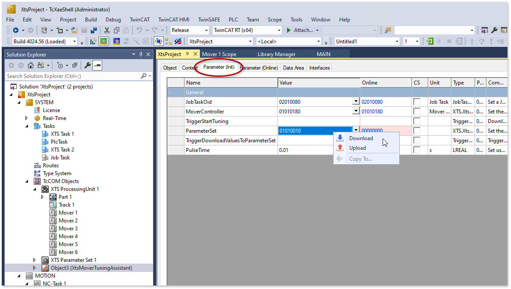{align=center}

11. チューニングアシストで得られた値をパラメータセットへ反映します
    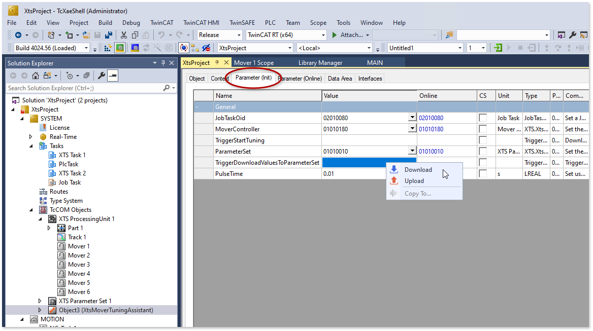{align=center}

12. ParameterSetを確認し、反映されていることを確認してください。
    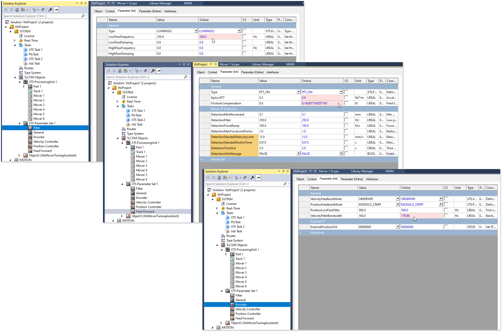{align=center}

13. 背景が赤色になっているものは`XTS Parameter Set 1`に保存されていません。右クリックして `Upload` を選択すると赤色背景が消え、設定が`XTS Parameter Set 1`に保存されていることがわかります。
    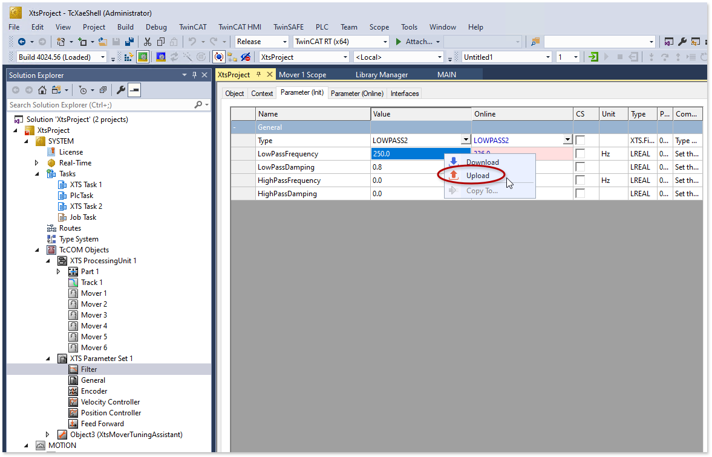{align=center}

## 速度ループのゲイン調整

```{note}
速度制御を行わない場合でも本節の調整は実施してください。
```

1. TwinCATがRunモードになっていることを確認して、位置制御のパラメータを無効にします。`XTS Parameter Set 1` - `Position Controller` から `Parameter(Init)` の中の `Kp`、`Kp_standstill` の値を `0` にします。そのあと、右クリックで`Download` をクリックします。
 
    ```{tip}
    以後の手順ではいずれも、設定後はぞれぞれ右クリックで`Download` をクリックして、設定値をドライブへ反映してください。
    ```

    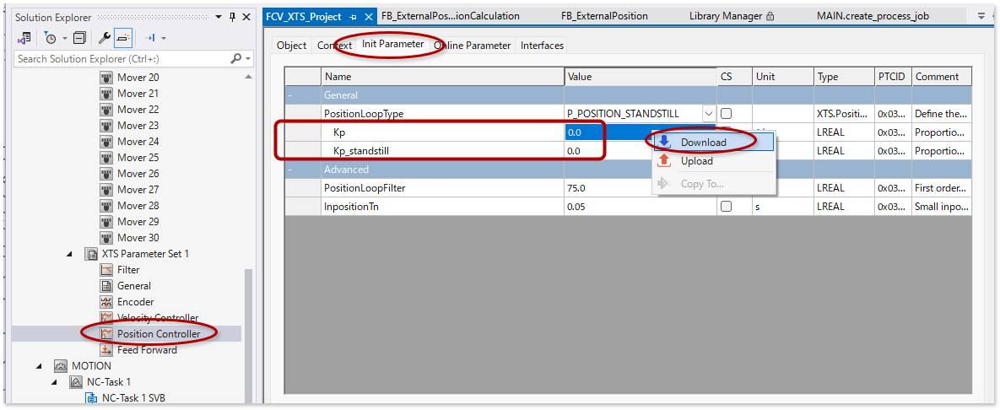{align=center}

2. 続いて制御モードを速度制御モードにするため、`General` をクリックして、`Parameter(Init)` タブの `OperationMode` を `CyclicSynchronusVelocity` に変更します。

    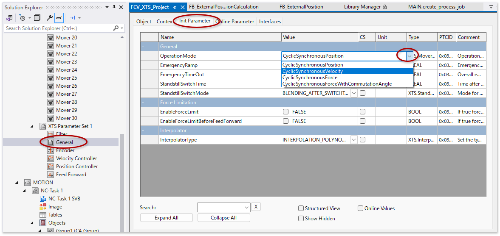{align=center}

3. `Velocity Controller` の `Init Parameter` タブから `Kp`と`Kp_standstil` を `0.01` 、`Tn`と`Tn_standstill`を `0` にセットしてダウンロードします。

    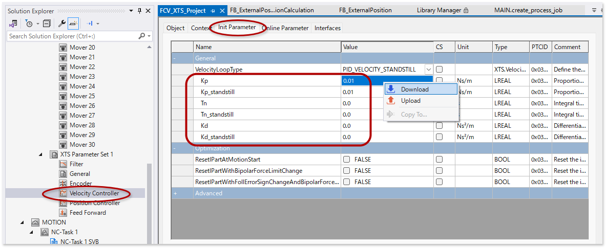{align=center}

4. `Axis` をクリックして、`Dynamics` タブで加減速度の調整を行います。`Indirect by Acceleration Time` を選択して、以下設定を行い、`Download` をクリックします。
   
    ```{csv-table}
    :header: パラメータ, 値, 単位

    Maximum Velocity,4000,$mm/s$
    Acceleration Time,0.18,$s$
    Deceleration Time,as above,$s$
    Acceleration Characteristic,stiff (バーを一番右へ),
    ```
    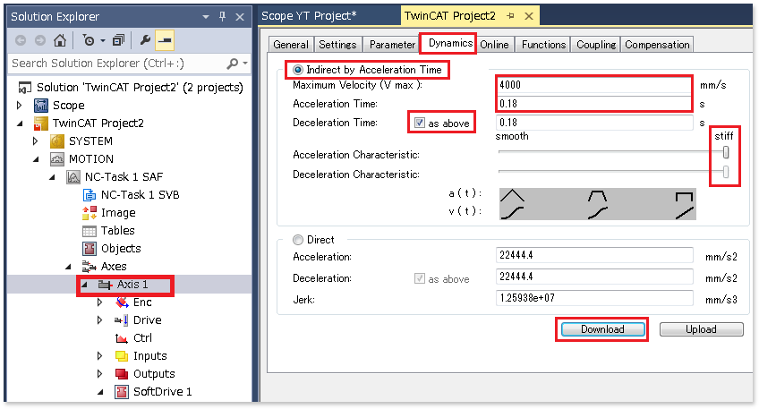{align=center}

5. 可動子をサーボON後、YT Scope Project のグラフ描画画面にいちど移動し、ツールバー付近の 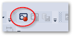 ボタンを押してScope viewを記録スタートさせます。そのあと、`Axis` - `Function` タブで、`Start Mode` をプルダウンメニューから `Velo Step Sequence` を選択。各種値を入力して（値はシステムにより変わる）、`Start` をクリックすると可動子は速度制御モードで動作します。

    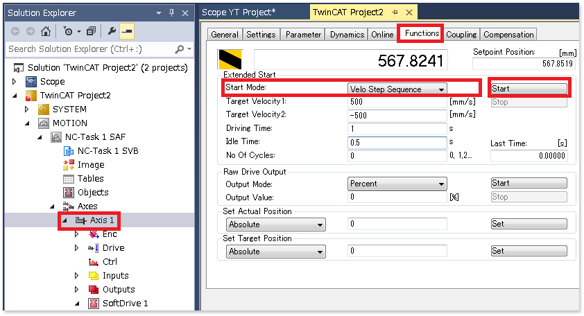{align=center}

6. Scope波形で、`SetVeloItp` と `ActVelo` を確認します。 `SoftDrive` - `VelocityCOntrolObj` 内の `Kp` を `0.01` ずつ変更します。（オーバーシュートがないくらいがベスト。 `Kp_standstill` は問題なければ `Kp` と同じ値に設定）

    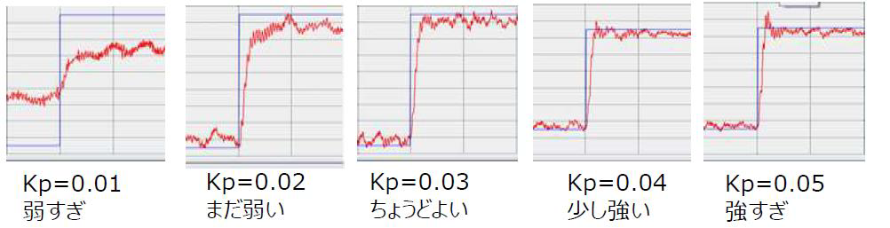{align=center}

7. 続いて、`Tn` を大きな値から `0.01` ずつ下げていく（オーバーシュートが速度の10%以内に収まるくらいがベスト。`Tn_standstill` は `Tn` と同じ値に設定）

    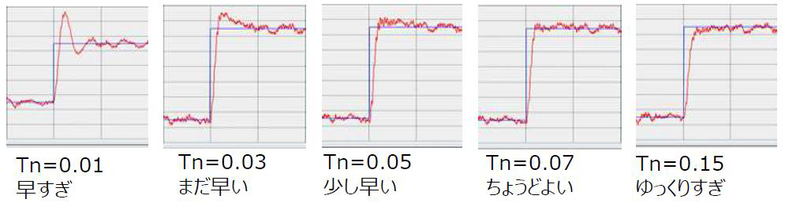{align=center}

8. 設定終了後、3. で設定した `OperationMode` を位置制御モード `CyclicSynchronusPosition` へ変更する。

    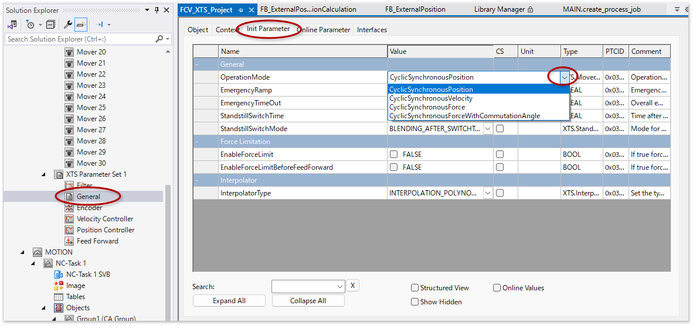{align=center}

つづいて次節の位置ループゲイン調整を実施してください。

## 位置ループのゲイン調整

1. 可動子をサーボON後、YT Scope Project のグラフ描画画面にいちど移動し、ツールバー付近の  ボタンを押してScope viewを記録スタートさせます。そのあと、`Axis` - `Function` タブで、`Start Mode` をプルダウンメニューから `Reversing Sequence` を選択。各種値を入力して（値はシステムにより変わる）、`Start` をクリックすると可動子は速度制御モードで動作します。

    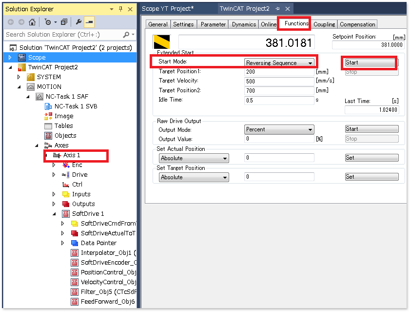{align=center}

2. `PositionControl_Obj` の `Kp` 、`Kp_standstill` の値を、`0.01` から徐々に大きくします。YT Scope波形で、`ActFollowingError` に注目し、この値が一番少なくなるように `Kp` 値を変更します。（`Kp_standstill`は `Kp` と同じ値に設定）

    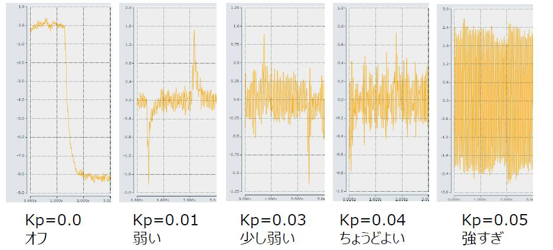{align=center}


3. ひととおりチューニングが終了したら、つぎのとおり `Position Lag Monitoring`　を有効設定 `TRUE` にします。

    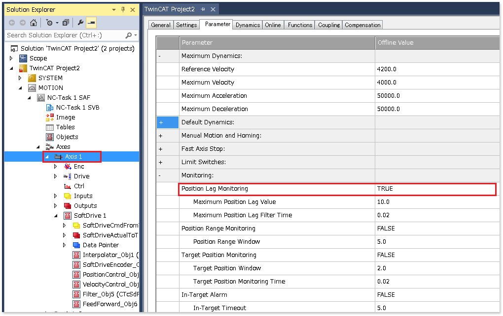{align=center}


## エリア設定

ストレート部分とカーブ部分では、可動子にかかるモーメント特性が変わるため（特に鉛直使用時）、同じゲイン設定を使用すると、ストレートからカーブ（またはその反対）に乗り移る際に、発振する可能性があります。これを防ぐために、XTSシステムでは、任意の区間を設定して、その区間特有のゲイン設定が可能です。（これをエリア設定と呼ぶ）エリア設定を行うためには、`SoftDrive` の `Parameter(Init)` タブ内にある `ControlAreas` の右側にあるプルダウンメニューから、エリア設定する区間数（この例では2区間）を選択します。その区間数に応じてパラメータが表示されるようになります。

```{csv-table}

IsEnabled, True
StartPosition,エリア開始位置
EndPosition,エリア終了位置
TransitionLength,エリアの移行区間
```